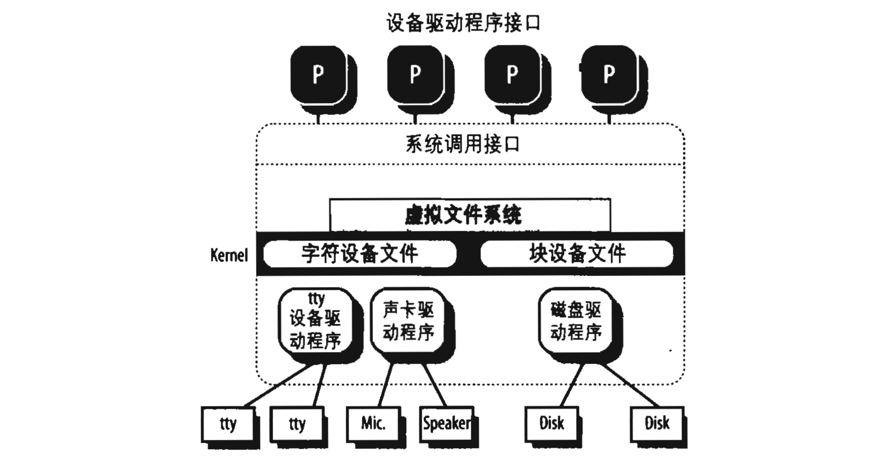

### 设备驱动程序

内核通过设备驱动程序（*device driver*）与 I/O 设备交互。设备驱动程序包含在内核中，由控制一个或多个设备的数据结构和函数组成，这些设备包括硬盘、键盘、鼠标、监视器、网络接口及连接到 SCSI 总线上的设备。通过特定的接口，每个驱动程序与内核中的其余部分（甚至与其他驱动程序）相互作用，这种方式具有以下优点：
- 可以把特定设备的代码封装在特定的模块中。
- 厂商可以在不了解内核源代码而只知道接口规范的情况下，就能增加新的设备。
- 内核以统一的方式对待所有的设备，并且通过相同的接口访问这些设备。
- 可以把设备驱动程序写城模块，并动态地把它们装进内核而不需要重新启动系统。不再需要时，也可以动态地卸下模块，以减少存储在 RAM 中的内核映射的大小。

图 1-4 说明了设备驱动程序与内核其余部分及进程之间的接口。

一些用户程序（P）希望操作硬件设备。这些程序就利用常用的、与文件相关的系统调用及在 */dev* 目录下能找到的设备文件向内核发出请求。实际上，设备文件是设备驱动程序接口中用户可见的部分。每个设备文件都有专门的设备驱动程序，它们由内核调用以执行对硬件设备的请求操作。

这里值得一提的是，在 Unix 刚出现的时候，图形终端是罕见而且昂贵的，因此 Unix 内核只直接处理字符终端。当图形终端变得非常普遍时，一些如 X Window 系统那样的特别的应用就出现了，它们以标准进程的身份运行，并且能直接访问图形界面的 I/O 端口和 RAM 的视频区域。一些新近的 Unix 内核，例如 Linux 2.6，对图形卡的帧缓冲提供了一种抽象，从而允许应用软件无需了解图形界面的 I/O 端口的任何知识就能对其进行访问（参见第十三章 “内核支持的级别” 一节）。
