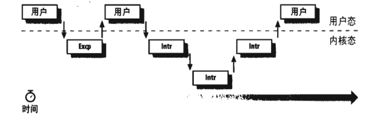

### 可重入内核

所有的 Unix 内核都是可重入的（*reentrant*），这意味着若干个进程可以同时在内核态下执行。当然，在单处理器系统上只有一个进程在真正运行，但是有许多进程可能在等待 CPU 或某一 I/O 操作完成时在内核态下被阻塞。例如，当内核代表某一进程发出一个读磁盘请求后，就让磁盘控制器处理这个请求并且恢复执行其他进程，当设备满足了读请求时，有一个中断就会通知内核，从而以前的进程可以恢复执行。

提供可重入的一种方式是编写函数，以便这些函数只能修改局部变量，而不能改变全局数据结构，这样的函数叫可重入函数。但是可重入内核不仅仅局限于这样的可重入函数（尽管一些实时内核正是如此实现的）。相反，可重入内核可以包含非重入函数，并且利用锁机制保证一次只有一个进程执行一个非重入函数。

如果一个硬件中断发生，可重入内核能挂起当前正在执行的进程，即使这个进程处于内核态。这种能力是非常重要的，因为这能提高发出中断的设备控制器的吞吐量。一旦设备已发出一个中断，它就一直等待直到 CPU 应答它为止。如果内核能够快速应答，设备控制器在 CPU 处理中断时就能执行其他任务。

现在，让我们看一下内核的可重入性及它对内核组织的影响。内核控制路径（*kernel control path*）表示内核处理系统调用、异常或中断所执行的指令序列。

在最简单的情况下，CPU 从第一条指令到最后一条指令顺序地执行内核控制路径。然而，当下述事件之一发生时，CPU 交错执行内核控制路径：

- 运行在用户态下的进程调用一个系统调用，而相应的内核控制路径证实这个请求无法立即得到满足；然后，内核控制路径调用调度程序选择一个新的进程投入运行。结果，进程切换发生。第一个内核控制路径还没完成，而 CPU 又重新开始执行其他的内核控制路径。在这种情况下，两条控制路径代表两个不两只的进程在执行。  
&emsp;

- 当运行一个内核控制路径时，CPU 检测到一个异常（例如，访问一个不在 RAM 中的页）。第一个控制路径被挂起，而 CPU 开始执行合适的过程。在我们的例子如，这种过程能给进程分配一个新页，并从磁盘读它的内容。当这个过程结束时，第一个控制路径可以恢复执行。在这种情况下，两个控制路径代表同一个进程的执行。  
&emsp;

- 当 CPU 正在运行一个启用了中断的内核控制路径时，一个硬件中断发生。第一个内核控制路径还没执行完，CPU 开始执行另一个内核控制路径来处理这个中断。当这个中断处理程序终止时，第一个内核控制路径恢复。在这种情况下，两个内核控制路径运行在同一进程的可执行上下文中，所花费的系统 CPU 时间 都算给这个进程。然而，中断处理程序无需代表这个进程运行。  
&emsp;

- 在支持抢占式调度的内核中，CPU 正在运行，而一个更高优先级的进程加入就绪队列，则中断发生。在这种情况下，第一个内核控制路径还没执行完，CPU 代表高优先级进程又开始执行另一个内核控制路径。只有把内核编译成支持抢占式调度之后，才可能出现这种情况。  

图 1-3 显示了非交错的和交错的内核控制路径的几个例子。考虑以下三种不同的 CPU 状态：

- 在用户态下运行一个进程（User）
- 运行一个异常处理程序或系统调用处理程序（Excp）
- 运行一个中断处理程序（Intr）

