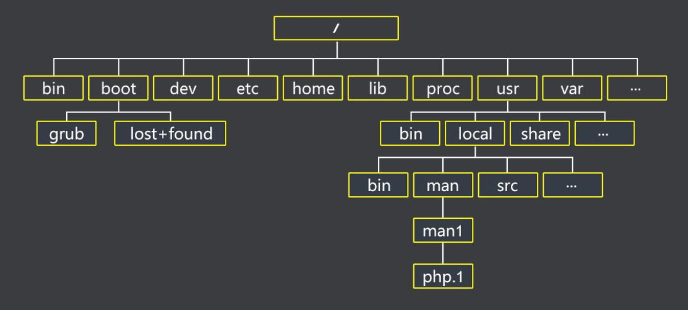

## Unix 文件系统概述

Unix 操作系统的设计集中反映在其文件系统上，文件系统有几个有趣的特点。因为在后面的章节中会反复提到这个特点，所以我们先回顾最重要的几个特点。

### 文件

Unix 文件是以字节序列组成的信息载体（*container*），内核不解释文件的内容。很多编程的库函数实现了更高级的抽象，例如，由字段构成的记录以及基于关键字编址的记录。然而，这些库中的程序必须依靠内核提供的系统调用。从用户的观点来看，文件被组织在一个树结构的命名空间中，如图 1-1 所示。



除了叶节点之外，树的所有节点都表示目录名。目录节点包含它下面文件及目录的所有信息。文件或目录名由除 "/" 和 空字节 "\0" 之外的任意 ASCII 字符序列组成。大多数文件系统对文件名的长度都有限制，通常不能超过 255 个字符。与树的根相对应的目录称为根目录（*root directory*）。按照惯例，它的名字是 "/"。在同一目录中的文件名不能相同，而在不同目录中的文件名可以相同。

Unix 的每个进程都有一个当前工作目录（参见本章后面的 “进程/内核模式” 一节），它属于进程执行上下文（*execution context*），标识出进程所用的当前目录。为了标识一个特定的文件，进程使用路径名（*pathname*），路径名由斜杠及一列指向文件的目录名交替组成。如果路径名的第一个字符是斜杠，那么这个路径就是绝对路径，因为它的起点是根目录。否则，如果第一项是目录名或文件名，那么这个路径就是所谓的相对路径，因为它的起点是进程的当前目录。

当标识文件名时，也用符号 "." 和 ".."。它们分别标识当前工作目录和父目录。如果当前工作目录是根目录，"." 和 ".." 就是一致的。

### 硬链接和软链接

包含在目录中的文件名就是一个文件的硬链接（*hard link*），或简称链接（*Link*）。在同一目录或不同的目录中，同一文件可以有几个链接，因此对应几个文件名。

Unix 命令：
```
ln P1 P2
```

用来创建一个新的硬链接，即为由路径 P1 标识的文件创建一个路径为 P2 的硬链接。

硬链接有两方面的限制：
- 不允许用户给目录创建硬链接。因为这可能把目录树变为环形图，从而就不可能通过名字定位一个文件。
- 只有在同一文件系统中的文件之间才能创建链接。这带来比较大的限制，因为现代 Unix 系统可能包含了多种文件系统，这些文件系统位于不同的磁盘和 / 或分区，用户也许无法知道它们之间的物理划分。

为了克服这些限制，引入了软链接（*soft link*）[也称为符号链接（*symbolic link*）]。符号链接是短文件，这些文件包含有另一个文件的任意一个路径名。路径名可以指向位于任意一个文件或目录，甚至可以指向一个不存在的文件。

Unix 命令：
```
ln -s P1 P2
```

创建一个路径名为 P2 的新软链接，P2 指向路径 P1。当这个命令执行时，文件系统抽出 P2 的目录部分，并在那个目录下创建一个名为 P2 的符号链接类型的新项。这个新文件包含路径名 P1。这样，任何对 P2 的引用都可以被自动转换成指向 P1 的一个引用。

### 文件类型

Unix 文件可以是下列类型之一：
- 普通文件（regular file）
- 目录
- 符号链接
- 面向块的设备文件（block-oriented device file）
- 面向字符的设备文件（character-oriented device file）
- 管道（pipe）和命名管道（named pipe）（也叫 FIFO）
- 套接字（socket）

前三种文件类型是所有 Unix 文件系统的基本类型。其实现将在第十八章详细讨论。

设备文件与 I/O 设备以及集成到内核中的设备驱动程序相关。例如，当程序访问设备文件时，它直接访问与那个文件相关的 I/O 设备（参见第十三章）。

管道和套接字是用于进程间通信的特殊文件（参见本章后面的 “同步和临界区” 一节以及第十九章）。

### 文件描述符与索引节点

Unix 对文件的内容和描述文件的信息给出了清楚的区分。除了设备文件和特殊文件系统文件外，每个文件都由字符序列组成。文件内容不包含任何控制信息，如文件长度或文件结束（end-of-file, EOF）符。

文件系统处理文件需要的所有信息包含在一个名为索引节点（*inode*）的数据结构中。每个文件都有自己的索引节点，文件系统用索引节点来标识文件。

虽然文件系统及内核函数对索引节点的处理可能随 Unix 系统的不同有很大的差异，但它们必须至少提供在 POSIX 标准中指定的如下属性：
- 文件类型（参见第一节）
- 与文件相关的硬链接个数
- 以字节为单位的文件长度
- 设备标识符（即包含文件的设备的标识符）
- 在文件系统中标识文件的索引节点号
- 文件拥有者的 UID
- 文件的用户组 ID
- 几个时间戳，表示索引节点状态改变的时间、最后访问时间及最后修改时间
- 访问权限和文件模式（参见下一节）

### 访问权限和文件模式

文件的潜在用户分为三种类型：
- 作为文件所有者的用户
- 同组用户，不包括所有者
- 所有剩下的用户（其他）

有三种类型的访问权限 --- 读、写及执行每组用户都有这三种权限。因此，文件访问权限的组合就用九种不同的二进制来标识。还有三种附加的标记，即 *suid (Set User ID)*，*sgid (Set Groud ID)*，及 *sticky* 用来定义文件的模式。当这些标识应用到可执行文件有如下含义：

* *suid*  
进程执行一个文件时通常保持进程拥有者的UID。然而，如果设置了可执行文件 suid 的标志位，进程就获得了该文件拥有者的 UID。  
&emsp;  

* *sgid*  
进程执行一个文件时保持进程组的用户组 ID。然而，如果设置了可执行文件 sgid 的标志位，进程就获得了该文件用户组的 ID。  
&emsp;  

* *sticky*  
设置了 sticky 标志位的可执行文件相当于向内核发出一个请求，当程序执行结束以后，依然把它保留在内存。  
&emsp;  

当文件由一个                                             

### 文件操作的系统调用

#### 打开文件

#### 访问打开的文件

#### 关闭文件

#### 更名及删除文件
