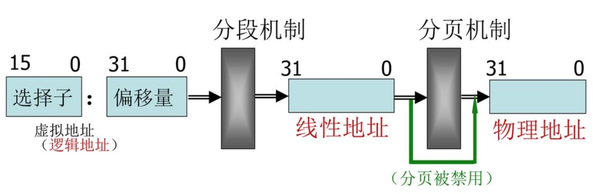

## 内存地址

程序员偶尔会引用内存地址（*memory address*）作为访问内存单元内容的一种方式，但是，当使用 80x86 微处理器时，我们必须区分以下三种不同的地址：

* ***逻辑地址（logical address）也称虚拟地址（virtual address）***  
包含在机器语言指令中用来指定一个操作数或一条指令的地址。这种寻址技术在 80x86 著名的分段结构中表现得尤为具体，它促使 MS-DOS 或 Windows 程序员把程序分为若干段。每个逻辑地址都由一个段（*segment*）和偏移量（*offset 或 displaement*）组成，偏移量指明了段开始的地方到实际地址之间的距离。  
&emsp;  

* ***线性地址（linear address）***  
是一个 32 位无符号整数，可以用来表示高达 4GB 的地址，也就是，高达 4294967296 个内存单元。线性地址通常由十六进制数字表示，值得范围从 `0x00000000` 到 `0xffffffff`。  
&emsp;  

* ***物理地址（physical address）***  
用于内存芯片级内存单元寻址。它们与从微处理器的地址引脚发送到内存总线上的电信号相对应。物理地址由 32 位或 36 位无符号整数表示。  
&emsp;  

内存控制单元（MMU）通过一种称为分段单元（segmentation unit）的硬件电路把一个逻辑地址转换成线性地址；接着，第二个称为分页单元（paging unit）的硬件电路把线性地址转换成一个物理地址（见图 2-1）。

