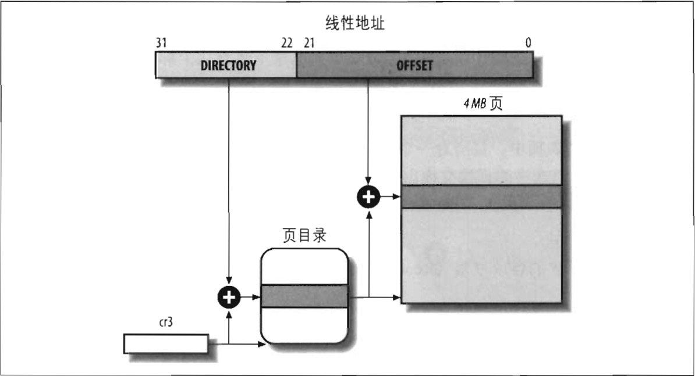

#### 扩展分页

从 Pentium 模型开始，80x86 微处理器引入了扩展分页（*extended paging*），它允许页框大小为 4MB 而不是 4KB（见图 2-8）。扩展分页用于把大段连续的线性地址转换成相应的物理地址，在这些情况下，内核可以不用中间页表进行地址转换，从而节省内存并保留 TLB 项（参阅 “转换后援缓冲器（TLB）” 一节）。

正如前面所述，通过设置页目录项的 `Page Size` 标志启动扩展分页功能。在这种情况下，分页单元把 32 位线性地址分成两个字段：

* *Directory*  
最高 10 位  
&emsp;

* *Offset*  
其余 32 位  
&emsp;

扩展分页和正常分页的页目录项基本相同，除了：
- `Page Size` 标志必须被设置。
- 20 位物理地址字段 只有最高 10 位是有意义的。这是因为每一个物理地址都是在以 4MB 为边界的地方开始的，故这个地址的最低 22 位为 0.

通过设置 cr4 处理器寄存器的 `PSE` 标志能使扩展分页与常规分页共享。
