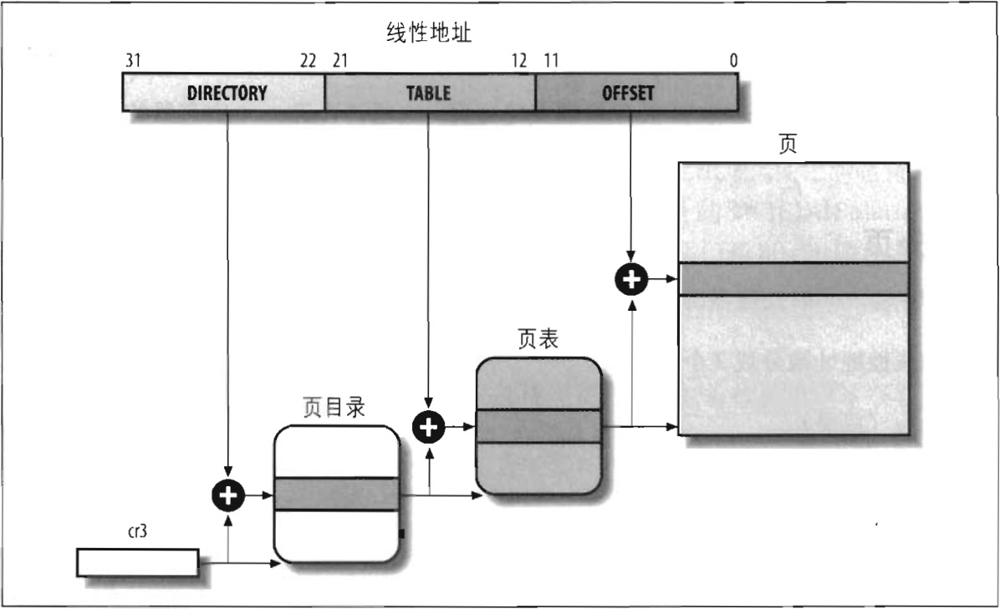

#### 常规分页

从 80386 起，Intel 处理器的分页单元处理 4KB 的页。

32 位的线性地址被分成 3 个域：

* *Directory（目录）*  
最高 10 位  
&emsp;

* *Table（页表）*  
中间 10 位  
&emsp;

* *Offset（偏移量）*  
最低 12 位  
&emsp;

线性地址的转换分两步完成，每一步是基于一种转换表，第一种转换表秒为页目录表（*page directory*），第二种转换表称为页表（*page table*）。

> 在接下来的讨论中，小写的 “page table” 表示保存线性地址和物理地址之间映射的页，而利用 “Page Table” 表示在上层页表中的页。

使用这种二级模式的目的在于减少每个进程页表所需 RAM 的数量。如果使用简单的一级页表，那将需要高达 $$2^{20}$$ 个表项（也就是，在每项 4 个字节时，需要 4MB RAM）来表示每个进程的页表（如果进程使用全部 4GB 线性地址空间），即使一个进程并不使用那个范围内的地址。二级模式通过只为进程实际使用的那些虚拟内存区请求页表来减少内存使用量。

每个活动进程必须有一个分配给它的页目录。不过，没有必要马上为进程的所有页表都分配 RAM 。只有在进程实际需要一个页表时才给该页表分配 RAM 会更有效率。

正在使用的页目录的物理地址存放在控制寄存器 cr3 中。$\underline{线性地址内的 Directory 字段决定页目录的目录项，而目录项指向适当的页表。地址的 Table 字段依次又决定页表中的表项，而表项含有页所有页框的物理地址}$。Offset 字段决定页框内的相对位置（见图 2-7）。由于它是 12 位长，故每一页含有 4096 字节的数据。

Directory 字段和 Table 字段都是 10 位长，因此页目录和页表都可以多达 1024 项。那么一个页目录可以寻址到高达 $$1024 * 1024 * 4096 = 2%{32}$$ 个存储单元，这和你对 32 位地址所期望的一样。

页目录项和页表项有同样的结构，每项都包含下面的字段：

* *Present标志*  
如果被置为1，所指的页（或页表）就在主存中；如果该标志为0，则一页不在主存中，此时这个表项剩余的位可由操作系统用于自己的目的。如果执行一个地址转换所需的页表项或页目录项中 `Present` 标志被清 0，那么分页单元就把该线性地址存放在控制寄存器 cr2 中，并产生 14 号异常：缺页异常。（我们将在第十七章看到 Linux 如何这个字段）。  
&emsp;

* *Field包含页框物理地址最高 20 位的字段*  
由于每个页框 4KB 的容量，它的物理地址必须是 4096 的倍数，因此物理地址的最低 12 位总是 0.如果这个字段指向一个页目录，相应的页框就含有一个页表；如果它指向一个页表，相应的页框就含有一页数据。  
&emsp;

* *`Accessed`标志*  
每当分页单元对相应页框进行寻址时就设置这个标志。当选中的页被交换出去时，这一标志就可以由操作系统使用。分页单元从来不重置这个标志，而必须由操作系统去做。  
&emsp;

* *`Dirty`标志*  
只应用于页表项中。每当对一个页框进行写操作时就设置这个标志。与 Accessed 标志一样，当选中的页被交换出去时，这一标志就可以由操作系统使用。分页单元从来不重置这个标志，而是必须由操作系统去做。  
&emsp;

* *`Read/Write`标志*  
含有页或页表的存取权限（Read/Write 或 Read）（参阅本章后面 “硬件保护方案” 一节）。  
&emsp;

* *`User/Supervisor`标志*  
含有访问页或页表所需的特权级（参阅本章后面 “硬件保护方案” 一节）。  
&emsp;

* *`PCD` 和 `PWT` 标志*  
控制硬件高速缓存处理页或页表的方式（参阅本章后面 “硬件高速缓存” 一节）。  
&emsp;

* *`Page Size` 标志*  
只应用于页目录项。如果设置为 1，页目录项指的是 2MB 或 4MB 的页框（参见下一节）。  
&emsp;

* *`Global` 标志*  
只应用于页表项。这个标志是在 Pentium Pro 中引入的，用来防止常用页从 TLB 高速缓存中刷新出去（参阅本章后面 “转换后援缓冲器（TLB）” 一节）。只有在 cr4 控制寄存器的页全局启用（Page Global Enable，PGE）标志置位时这个标志才起作用。  
&emsp;

> TLB 的全称为 Translation Lookaside Buffer，这是 IBM 的叫法，有时也叫联想内存（Associative Memory），俗称 “快表” 。

