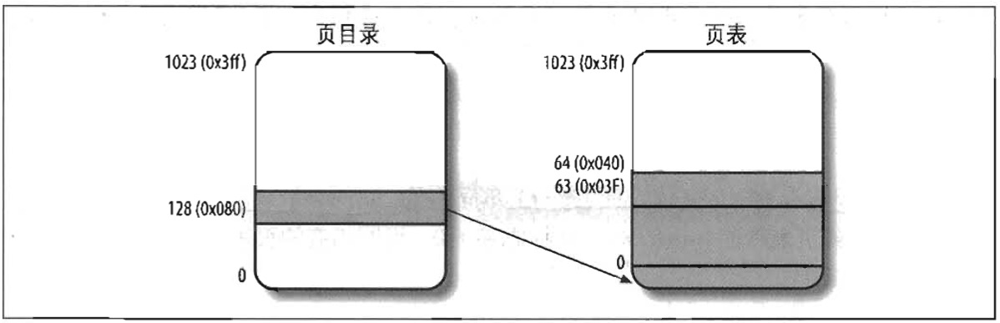

#### 常规分页举例

这个简单的例子将有助于阐明常规分页是如何工作的。

我们假定内核已经给一个正在运行的进程分配的线性地址僮范围是 `0x20000000` 到 `0x2003ffff`。这个空间正在由 64 页组成。我们不必关心包含这些页的页框的物理地址，事实上，其中的一些页甚至可能不在主存中。我们只关注页表项中剩余的字段。

> 正如我们在后面章节所看到的那样，3GB 线性地址空间是一个上限，但是用户态进程只允许引用其中的一个子集。

让我们分配给进程的线性地址的最高 10 位（分页单元解释为 Directory 字段）开始。让两个地址都以 2 开关后面跟着 0，因此高 10 位有相同的值，即 `0x080` 或十进制的 `128`。因此，这两个地址的 Directory 字段都指向进程页目录的第 129 项。相应的目录项中的必须包含分配给该进程的页表的物理地址（见图 2-9）。如果没有给这个进程分配其它 的线性地址，则页目录的其余 1023 项都填为 0 。

中间 10 位的值（即 Table 字段的值）范围从 `0` 到 `0x03f`，或十进制的从 `0` 到 `63`，因而只有页表的前 64 个表项是有意义的，其余 960 个表项都填 0。

假设进程需要读线性地址 `0x20021406` 中的字节。这个地址由分页单元按下面的方法处理：

1. Directory 字段的 `0x80` 用于选择页目录的第 `0x80` 目录项，此目录项指向和该进程的页相关的页表。
2. Table 字段 `0x21` 用于选择页表的第 `0x21` 表项，此表项指向包含所需页的页框。
3. 最后，Offset 字段 `0x406` 用于在目标页框中读偏移量为 `0x406` 中的字节。

如果页表第 `0x21` 表项的 Present 标志为 0，则此页就不在主存中；在这种情况下，分页单元在线性地址转换的同时产生一个缺页异常。无论何时，当进程试图访问限定在 `0x20000000` 到 `0x2003ffff` 范围之外的线性地址时，都将产生一个缺页异常，因为这些页表项都填充了 0，尤其是它们的 Present 标志都被清 0 。
