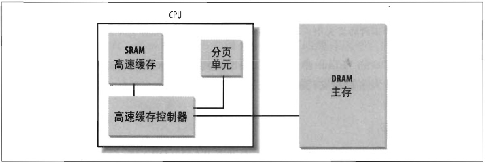
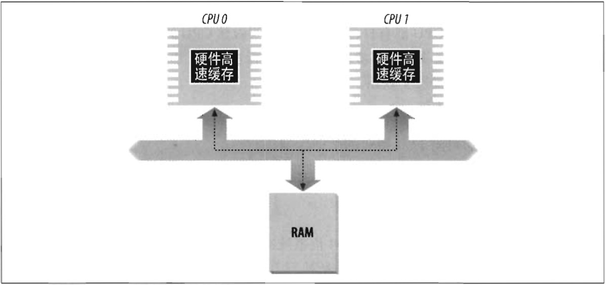

#### 硬件高速缓存

当今的微处理器时钟频率接近几个 GHz，而动态 RAM（DRAM）芯片的存取时间是时钟周期的数百倍。这意味着，当从 RAM 中取操作数或向 RAM 中存放结果这样的指令执行时，CPU可能等待很长时间。

为了缩小 CPU 和 RAM 之间的速度不匹配，引入了硬件高速缓存内存（*hardware cache memory*）。硬件高速缓存基于其名的局部性原理（*locality principle*），该原理既适用程序结构也适用于数据结构。这表明由于程序的循环结构及相关数据可以组织成线性数组，最近最常用的相邻地址在最近的将来又被用到的可能性极大。因此，引入小而快的内存来存放最近最常使用的代码和数据变得很有意义。为此，80x86 体系结构中引入了一个叫行（*line*）的新单位。行由几十个连续的字节组成，它们以脉冲突发模式（burst mode）在慢速 DRAM 和快速的用来实现高速缓存的片上静态 RAM（SRAM）之间传送，用来实现高速缓存。

高速缓存再被细分为行的子集。在一种极端的情况下，高速缓存可以是直接映射的（*direct mapped*），这时主存中的一个行总是存放在高速缓存中完全相同的位置。在另一种极端情况下，高速缓存是充分关联的（*fully associative*），这意味着主存中的任意一个行可以存放在高速缓存中的任意位置。但是大多数高速缓存存在某种程度上是 N路组关联的（*N-way set associative*），意味着主存中的任意一个行可以存放在高速缓存 N 行中的任意一行中。例如，内存中的一个行可以存放到一个 2 路组关联高速缓存两个不同的行中。

如图 2-10 所示，高速缓存单元插在分页单元和主内存之间。它包含一个硬件高速缓存内存和一个高速缓存控制器（*cache controller*）。高速缓存内存存放内存中真正的行。高速缓存控制器存放一个表项数组，每个表项对应高速缓存内存中的一个行。每个表项有一个标签（*tag*）和描述高速缓存存行状态的几个标志（*flag*）。这个标签由一些位组成，这些位让高速缓存控制器能够辨别由这个行当前所映射的内存单元。这种内存物理地址通常分为 3 组：最高几位对应标签，中间几位对应高速缓存控制器的子集索引，最低几位对应行内的偏移量。

当访问一个 RAM 存储单元时，CPU 从物理地址中提取出子集的索引号并把子集中所有行的标签与物理的高几位相比较。如果发现某一个行的标签与这个物理的高位相同，则 CPU 命中一个高速缓存（*cache hit*）；否则，高速缓存没有命中（*cache miss*）。

当命中一个高速缓存时，高速缓存控制器进行不同的操作，具体取决于存取类型。
- 对于读操作，控制器从高速缓存行中选择数据并送到 CPU 寄存器；不需要访问 RAM 因而节约了 CPU 时间，因此，高速缓存系统起到了其应有的作用。
- 对于写操作，控制器可能采用以下两个基本策略之一，分别称为通写（*write-through*）和回写（*write-back*）。
  - 在通写中，控制器总是既写 RAM 也写高速缓存行，为了提高写操作的效率关闭高速缓存。
  - 回写方式只更新高速缓存行，不改变 RAM 的内容，提供了更快的功效。当然，回写结束以后，RAM 最终必须被更新。只有当 CPU 一条要求刷新高速缓存表项指令时，或者当一个 FLUSH 硬件信号产生时（通常在高速缓存不命中之后），高速缓存控制器把高速缓存行写回到 RAM 中。

当高速缓存没有命中时，高速缓存行被写回到内存中，如果有必要的话，把正确的行从 RAM 中取出放到高速缓存表项中。

多处理器系统的每一个处理器都有一个单独的硬件高速缓存，因此它们需要额外的硬件电路用于保持高速缓存内容的同步。如图 2-11 所示中，每个 CPU 都有自己的本地硬件高速缓存。但是，现在更新变得更耗时：只要一个 CPU 修改了它的硬件高速缓存，它就必须检查同样的数据是否包含在其他的硬件高速缓存中；如果是，它必须通知其他 CPU 用适当的值对其更新。常把这种活动叫做高速缓存侦听（*cache snooping*）。值得庆幸的是，所有这一切都在硬件级处理，内核无需关心。

高速缓存技术正在快速向前发展。例如，第一代 Pentium 芯片包含一颗称为 *L1-cache* 片上高速缓存。近期的芯片又包含另外的容量更大、速度较慢，称之为 *L2-cache*、*L3-cache* 等的片上高速缓存。多级高速缓存之间的一致性是由硬件实现的。Linux 忽略这些硬件细节并假定只有一个单独的高速缓存。

处理器的 ct0 寄存器 的 CD 标志位用来启用或禁用高速缓存电路。这个寄存器中的 NW 标志指明高速缓存是使用通写还是回写策略。

Pentium 处理器高速缓存的另一个有趣的特点是，让操作系统把不同的高速缓存管理策略与每一个页框相关联。为此，每一个页目录项和每一个页表项都包含两个标志：
- `PCD（Page Cache Disable）`标志指明当访问包含在这个页框中的数据时，高速缓存功能必须被启用或禁用。
- `PWT（Page Write-Through）`标志指明当把数据写到页框时，必须使用的策略是回写策略还是通写策略。

**Linux 清除了所有页目录项和页表项中的 PCD 和 PWT 标志；结果是：对于所有的页框都启用高速缓存，对于写操作总是采用回写策略。**

