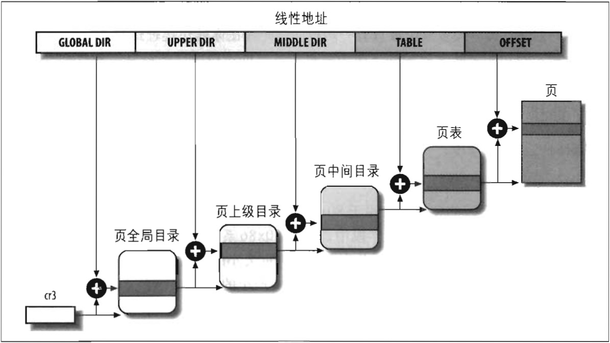

## Linux 中的分页

Linux 采用了一种同时适用于 32 位和 64 位系统的普通分页模型。正像前面 “64 位系统中的分页” 一节所解释的那样，两级页表对 32 位系统来说已经足够了，但 64 位系统需要更多数量的分页级别。直到 2.6.10 版本，Linux 采用三级分页的模型。从 2.6.11 版本开始，采用了四级模型。

> 这个变化用来全力支持 x86_64 平台使用的对线性地址的位的划分（参见表 2-4）。

图 2-12 中展示的 4 种页表分别称为：

- 页全局目录（Page Global Directory）
- 页上级目录（Page Upper Directory）
- 页中间目录（Page Middle Directory）
- 页表（Page Table）

页全局目录包含若干页上级目录的地址，页上级目录又依次包含若干页中间目录的地址，而页中间目录又包含若干页表的地址。每一个页表项指向一个页框。线性地址因此被分成五个部分。图 2-12 没有显示位数，因为每一部分的大小与具体的计算机体系结构有关。

对于没有启用物理地址扩展的 32 位系统，两级页表已经足够了。Linux 通过使 “页上级目录” 位和 “页中间目录” 位全为 0，从根本上取消了页上级目录和页中间目录字段。不过，页上级目录和页中间目录在指针序列中的位置被保留，以便同样的代码在 32 位系统和 64 位系统下都能使用。内核为页上级目录和页中间目录保留了一个位置，这是通过把它们的页目录项数设置为 1，并把两个目录项映射到页全局目录的一个适当的目录项而实现的。

启用了物理地址扩展的 32 位系统使用了三级页表。Linux的页全局目录对应 80x86 的页目录指针表（PDPT），取消了页上级目录，页中间目录对应 80x86 的页目录，Linux 的页表应对 80x86 的页表。

最后，64 位系统使用三级还是四级分页取决于硬件对线性地址的位的划分（见表 2-4）。

Linux 的进程处理很大程序上依赖于分页。事实上，线性地址到物理地址的自动转换使用下面的设计目标变得可行：
- 给每一个进程分配一块不同的物理地址空间，这确保了可以有效地防止寻址错误。
- 区别页（即一组数据）和页框（即主存中的物理地址）之不同。这就允许存放在某个页框中的一个页，然后保存到磁盘上，以后重新装入这同一页时又可以被装在不同的页框中。这就是虚拟内存机制的基本要素（参见第士七章）。

在本章剩余的部分，为了具体起见，我们将涉及 80x86 处理器使用的分页机制。

我们将在第九章看到，每一个进程有它自己的页全局目录和自己的页表集。当发生进程切换时（参见第三章 “进程切换” 一节），**Linux 把 cr3 控制寄存器的内容保存在前一个执行进程的描述符中，然后把下一个要执行进程的描述符的值装入 cr3 寄存器中**。因此，当新进程重新开始在 CPU 上执行时，分页单元指向一组正确的页表。

把线性地址映射到物理地址虽然有点复杂，但现在已经成为了一种机械式的任务。本章下面的几节中列举了一些比较单调乏味的函数和宏，它们检索内核为了查找地址和管理表格所需的信息；其中大多数函数只有一两行。也许现在你就想跳过这部分，但是知道这些函数和宏的功能是非常有用的，因为在贯穿本书的讨论中你会经常看到它们。

