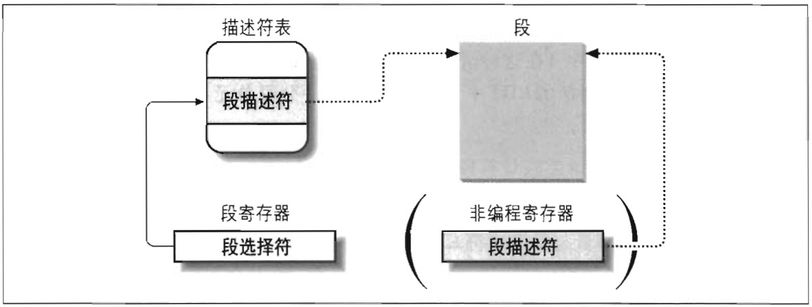

### 快速访问段描述符

我们回忆一下：逻辑地址由 16 位段选择符和 32 位偏移量组成，段寄存器仅仅存放段选择符。

为了加速逻辑地址到线性地址的转换，80x86 处理器提供一种附加的非编程的寄存器（一个不能被程序员所设置的寄存器），供 6 个可编程的段寄存器使用。每一个非编程的寄存器含有 8 个字节的段描述符（在前一节已讲述），由相应的段寄存器中的段选择符来指定。每当一个段选择符被装入段寄存器时，相应的段描述符就由内存装入到对应的非编程 CPU 寄存器。从那时起，针对 那个段的逻辑地址转换就可以不访问主存中的 GDT 或 LDT，处理器只需直接引用存放段描述符的 CPU 寄存器即可。仅当段寄存器的内容改变时，才有必要访问 GDT 或 LDT（参见图 2-4）。



&emsp;

表 2-2 描述了什么问题段选择符所包含的 3 个字段。

字段名 | 描述
--- | ---
`index` | 指定了放在 GDT 或 LDT 中的相应段描述符的入口（在下面将作进一步的讲述）
`TI` | TI（*Table Indicator*）标志：指明段描述符是在 GDT 中（TI=0）或在 LDT 中（TI=1）
`RPL` | 请求者特权级：当相应的段选择符装入到 cs 寄存器中时批示出 CPU 当前的特权级；它还可以用于在访问数据段时胡选择地削弱处理器的特权级（详情请参见 Intel 文档）

由于一个段描述符是 8 字节长，因此它在 GDT 或 LDT 内的相对地址是由段选择符的最高 13 位的值乘以 8 得到的。例如：如果 GDT 在 `0x00020000`（这个值保存在 `gdtr` 寄存器中），且由段选择符所指定的索引号为 2，那么相应的段描述符地址是 `0x00020000 + (2 * 8)`，或 `0x00020010`。

GDT 的第一项总是设为 0。这就确保空段选择符的逻辑地址会被认为是无效的，因此，引起一个处理器异常。能够保存在 GDT 中的段描述符的最大数目是 8191，即 
```math
2^13 - 1
平行四边行面积 = 底 \times 高
```
