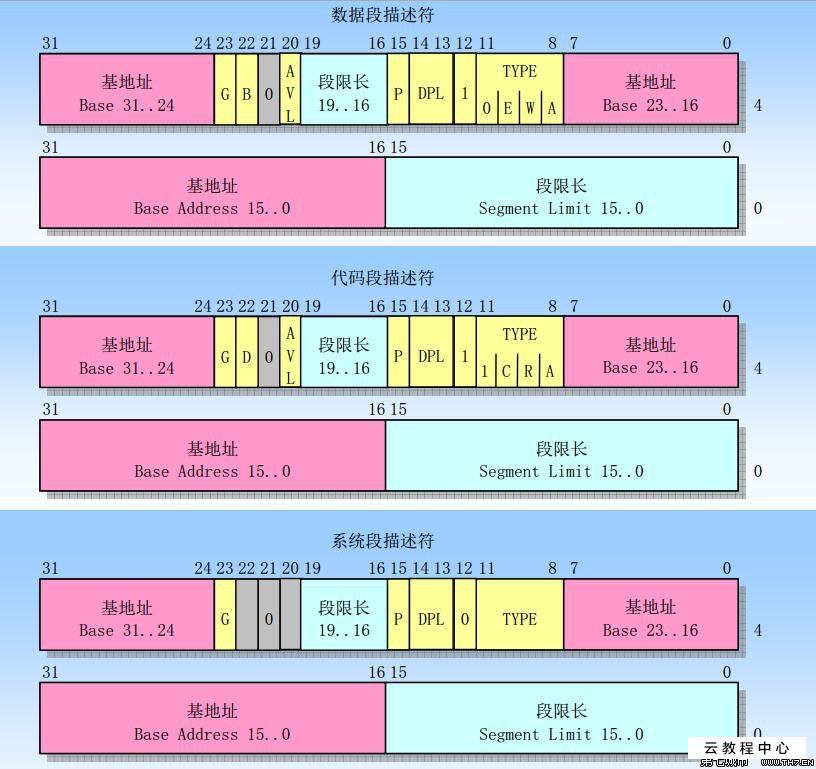

### 段描述符

每个段由一个8字节的段描述符（*Segement Descriptor*）表示，它描述了段的特征。段描述符放在全局描述符表（*Global Descriptor Table, GDT*）或局部描述符表（*Local Descriptor Table, LDT*）中。

通常只定义一个 GDT，而每个进程除了存放在 GDT 中的段之外如果还需要创建附加的段，就可以有自己的 LDT。GDT 在主存中的地址和大小存放在 `gdtr` 控制寄存器中，当前正在被使用的 LDT 地址和大小都放在 `ldtr` 控制寄存器中。

有几种不同类型的段以及和它们对应的段描述符。下面列出了 Linux 中被广泛采用的类型：

* *代码段描述符*  
表示这个段描述符代表一个代码段，它可以放在 GDT 或 LDT 中。该描述符置 S 标志为 1（非系统段）。  
&emsp;

* *数据段描述符*  
表示这个段描述符代表一个数据段，它可以放在 GDT 或 LDT 中。该描述符置 S 标志为 1。栈段是通过一般的数据段实现的。  
&emsp;

* *任务状态段描述符（TSSD）*  
表示这个段描述符代表一个任务状态段（Task State Segment, TSS），也就是说这个段用于保存处理器寄存器的内容（参见第三章 “任务状态段” 一节）。它只能出现在 GDT 中。根据相应的进程是否正在 CPU 上运行，其 `TYPE` 字段的值分别为 11 或 9。这个描述符的 S 标志置为 0。  
&emsp;

* *局部描述符表描述符（LDTD）*  
表示这个段描述符代表一个 LDT 的段，它只出现在 GDT 中。相应的 `TYPE` 字段的值为 2，S 标志置为 0。下一节说明 80x86 处理器如何决定一个段描述符是存放在 GDT 中还是存放在进程的 LDT 中。  
&emsp;

图 2-3 阐明了段描述符的格式。

表 2-1 解释了图中各个字段的含义

字段名 | 描述
--- | ---
`Base` | 包含段的首字节的线性地址
