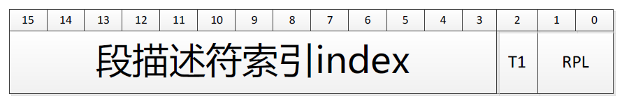

### 段选择符和段寄存器

一个逻辑地址由两部分组成：一个段标识符和一个指定段内相对地址的偏移量。段标识符是 16 位长的字段，称为段选择符（*Segment Selector*），如图 2-2 所示，而偏移量是一个 32 位长的字段。我们将在本章 “快速访问段描述符” 一节中描述段选择符字段。

为了快速方便地找到段选择符，处理器提供段寄存器，段寄存器的唯一目的是存放段选择符。这些段寄存器称为 cs、ss、ds、es、fs 和 gs。尽管只有6个段寄存器，但程序可以把同一个段寄存器用于不同的目的，方法是先将其值保存在内存中，用完再恢复。

6 个寄存器中 3 个有专门的用途：
- cs 代码寄存器，指向包含程序指令的段。
- ss 栈段寄存器，指向包含当前程序栈的段。
- ds 数据段寄存器，指向包含静态数据或全局数据段。

其他 3 个段寄存器作一般用途，可以指向任意的数据段。

cs 寄存器还有一个很重要的功能：它包含有一个两位的字段，用以指明 CPU 的特权级（Current Privilege Level, CPL）。值为 0 代表最高优先级，而值为 3 代表最低优先级。Linux 只用 0 级和 3 级，分别称之为内核态和用户态。
