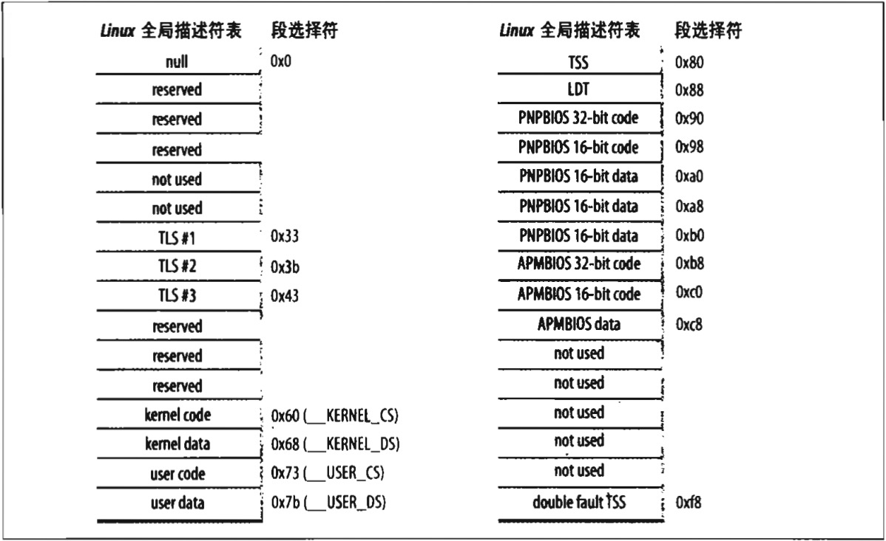

#### Linux GDT

在单处理器系统中只有一个 GDT，而在多处理器系统中每个 CPU 对应一个 GDT。所有的 GDT 都存放在 `cpu_gdt_table` 数组中，而所有 GDT 的地址和它们的大小（当初始化 `gdtr` 寄存器时使用）被存放在 `cpu_gdt_descr` 数组中。如果你到源代码索引中查看，可以看到这些符号都在文件 *arch/i386/kernel/head.S* 中被定义。本书中的每一个宏、函数和其他符号都被列在源代码索引中，所有能在源代码中很方便地找到它们。

图 2-6 是 GDT 的布局示意图。每个 GDT 包含 18 个段描述符和 14 个空的，未使用的，或保留的项。插入未使用的项的目的是为了使经常一起访问的描述符能够片于同一个 32 字节的硬件高速缓存行中（参见本章后面 “硬件高速缓存” 一节）。

每一个 GDT 中包含的 18 个段描述符指向下列的段：
- 用户态和内核态下的代码段和数据段共 4 个（参见前面一节）。  
&emsp;

- 任务状态段（TSS），每个处理器有 1 个。每个 TSS 相应的线性地址空间都是内核数据段相应线性地址空间的一个小子集。所有的任务状态段都顺序地存放在 `init_tss` 数组中；值得特别说明的是，第 n 个 CPU 的 TSS 描述符的 `Base` 字段指向 `init_tss` 数组的第 n 个元素。G（粒度）标志被清 0，而 `Limit` 字段置为 `0xeb`，因为 TSS 段是 236 字节长。`Type` 字段置为 9 或 11（可用的 32 位 TSS），且 `DPL` 置为 0，因为不允许用户态下的进程访问 TSS 段。在第三章 “任务状态段” 一节你可以找到 Linux 是如何使用 TSS 的细节。  
&emsp;

- 1 个包括缺省局部描述符表的段，这个段通常是被所有进程共享的段（参见下一节）。  
&emsp;

- 3 个局部线程存储（*Thread-Local Storage, TLS*）段：这种机制允许多线程应用程序使用最多 3 个局部于线程的数据段。系统调用 `set_thread_area()` 和 `get_thread_area()` 分别为正在执行的进程创建和撤消一个 TLS 段。  
&emsp;

- 与高级电源管理（APM）相关的 3 个段：由于 BIOS 代码使用段，所以当 Linux APM 驱动程序调用 BIOS 函数来获取或者设置 APM 设备的状态时，就可以使用自定义的代码段和数据段。  
&emsp;

- 与支持即插即用（PnP）功能的 BIOS 服务程序相关的 5 个段：在前一种情况下，就像前述与 APM 相关的 3 个段的情况一下，由于 BIOS 例程使用段，所以当 Linux 的 PnP 设备驱动程序调用 BIOS 函数来检测 PnP 设备使用的资源时，就可以使用自定义的代码段和数据段。  
&emsp;

- 被内核用来处理 “双重错误” 异常的特殊 TSS 段（参见第四章的 “异常” 一节）。  
&emsp;

如前所述，系统中每个处理器都有一个 GDT 副本。除少数几种情况以外，所有 GDT 的副本都存放相同的表项。首先，每个处理器都有它自己的 TSS 段，因此其对应的 GDT 项不同。其次，GDT 中只有少数项可能依赖于 CPU 正在执行的进程（LDT 和 TLS 段描述符）。最后，在某些情况下，处理器可能临时修改 GDT 副本里的某个项；例如，当调用 APM 的 BIOS 例程时就会发生这种情况。
