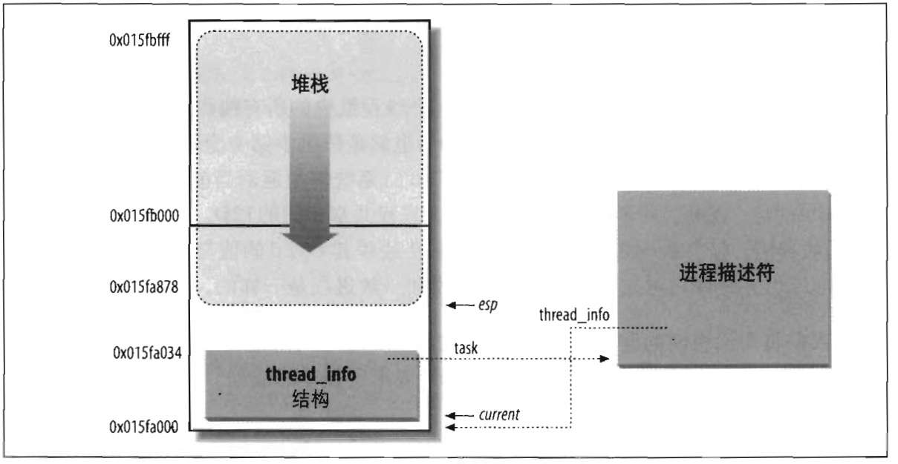
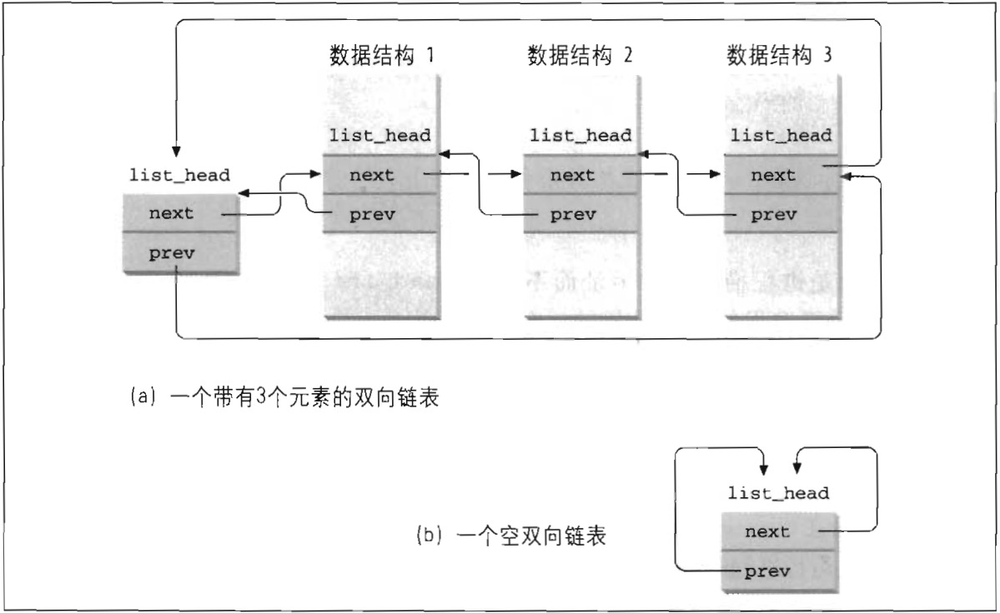

# 标识一个进程

一般来说，能被独立调度的每个执行上下文都必须拥有它自己的进程描述符；因此，即使共享内核大部分数据结构的轻量级进程，也有它们自己的 task_struct 结构。

进程和进程描述符之间有非常严格的一一对应关系，这使得用 32 位进程描述符地址标识进程成为一种方便的方式。进程描述符指针指向这些地址，内核对进程的大部分引用是通过进程描述符指针进行的。

> 正在已经在第二章的 “Linux 中的分段” 一节中说明的那样，尽管从技术上说，这 32 位仅仅是一个逻辑地址的偏移量部分，蛤它们与线性地址相一致。

另一方面，类 Unix 操作系统允许用户使用一个叫做进程标识符 *process ID, PID* 的数来标识进程，PID存放在进程描述符的 pid 字段中。PID 被顺序编号，新创建进程的 PID 通常是前一个进程的 PID + 1。不过，PID 的值有一个上限，当内核使用的 PID 达到这个上限值的时候就必须开始循环使用已闲置的小 PID 号。在缺省情况下，最大的 PID 号是 32767（`PID_MAX_DEFAULT-1`）；系统管理员可以通过往 `/proc/sys/kernel/pid_max` 写入一个更小的值来减小 PID 的上限值，使 PID 的上限小于 32767。（/proc 是一个特殊文件系统的安装点，参看第十二章 “特殊文件系统” 一节。）在 64 位体系结构中，系统管理员可以把 PID 的上限扩大到 4194303。

由于循环使用 PID 编号，内核必须通过管理一个 pidmap-array 位图来表示当前已分配的 PID 和闲置的 PID。因为一个页框包含 32768 个位，所以在 32 位体系结构中 pidmap-array 位图存放在一个单独的页中。然而，在 64 位体系结构中，当内核分配了超过当前位图大小的 PID 号时，需要为 PID 位图增加更多的页。系统会一直保存这些页不被释放。 

Linux 把不同的 PID 与系统中每个进程或轻量级进程相关联（本章后面我们会看到，在多处理器系统上稍有例外）。这种方式能提供最大的灵活性，因为系统中每个执行上下文都可以被唯一地识别。

另一方面，Unix 程序员希望同一组中的线程有共同的 PID。例如，把指定 PID 的信号发送级组中的所有线程。事实上，POSIX 1003.1c 标准规定一个多线程应用程序中的所有线程都必须有相同的 PID。

遵照这个标准，Linux 引入线程组的表示。一个线程组中的所有线程使用和该线程组的领头线程（*thread group leader*）相同的 PID，也就是该组中第一个轻量级进程的 PID，它被存入进程描述符的 tgid 字段中。`getpid()` 系统调用返回当前进程的 tgid 值而不是 pid 值，因此，一个多线程应用的所有线程共享相同的 PID。绝大多数进程都属于一个线程组，包含单一的成员；线程组的领头线程其 tgid 的值与 pid 的值相同，因而 `getpid()` 系统调用这类进程所起的作用和一般进程是一样的。

下面，我们将向你说明如何从进程的 PID 中有效地导出它的描述符指针。效率至关重要，因为像 `kill()` 这样的很多系统调用使用 PID 表示所操作的进程。

## 进程描述符处理

进程是动态实体，其生命周期范围从几毫秒到几个月。因此，内核必须能够同时处理很多进程，并把进程描述符存放在动态内存中，而不是放在永久分配给内核的内存区。对每个进程来说，Linux 都把两个不同的数据结构紧凑地存放在一个单独为进程分配的存储区域内：一个是内核态的进程堆栈，另一个是紧挨进程描述符的小数据结构 thread_info，叫做线程描述符，这块存储区域的大小通常为 8192 字节（两个页框）。考虑到效率的因素，内核让这 8K 空间占据连续的两个页框并让第一个页框的起始地址是 $$2^{13}$$ 的倍数。当几乎没有可用的动态内存空间时，就会很难找到这样的两个连续页框，因为空闲空间可能存在大量碎片（见第八章 “伙伴系统算法” 一节）。因此，在 80x86 体系结构中，在编译时可以进行设置，以使内核栈和线程描述符跨越一个单独的页框（4096 个字节）。

在第二章 “Linux 中的分段” 一节中我们已经知道，内核态的进程访问处于内核数据段的栈，这个栈不同于用户态的进程所用的栈。因为内核控制路径使用很少的栈，因此只需要几千个字节的内核态堆栈。所以，对栈和 thread_info 结构来说，8KB 足够了。不过，当使用一个页框存放内核态堆栈和 thread_info 结构时，内核要采用一些额外的栈以防止中断和异常的尝试嵌套而引起的溢出（见第四章）。

图 3-2 显示了 2 页（8KB）内存区中存放两种数据结构的方式。线程描述符驻留于这个内存区的开始，而栈从末端向下增长。该图还显示了分别通过 task 和 thread_info 字段使用 thread_info 结构与 task_struct 结构互相关联。



esp 寄存器是 CPU 栈指针，用来存放栈项单元的地址。在 80x86 系统中，栈起始于末端，并朝这个内存区开始的方向增长。从用户态刚切换到内核态以后，进程的内核栈总是空的，因此，esp 寄存器指向这个栈的顶端。

一旦数据写入堆栈，esp 的值就递减。因为 thread_info 结构是 52 个字节长，因此内核栈能扩展到 8140 字节。

C 语言使用下列的联合结构方便地表示一个进程的线程描述符和内核栈：
```
union thread_union {
    struct thread_info thread_info;
    unsigned long stack[2048]; /* 对 4K 的栈数组下标是 1024 */
};
```

如图 3-2 所示，thread_info 结构从 `0x015fa000` 地址处开始存放，而栈从 `0x015fc000` 地址处开始存放。esp 寄存器的值指向地址为 `0x015fa878` 的当前栈顶。

内核使用 `alloc_thread_info` 和 `free_thread_info` 宏分配和释放存储 thread_info 结构和内核栈的内存区。

## 标识当前进程

从效率的观点来看，刚才所讲的 thread_info 结构与内核态堆栈之间的紧密结合提供的主要好处是：内核很容易从 esp 寄存器的值获得当前在 CPU 上正在运行进程的 thread_info 结构的地址。事实上，如果 thread_union 结构长度是 8K（$$2^{13}字节），则内核屏蔽掉 esp 的低 13 位有效位就可以获得 thread_info 结构的基地址；而如果 thread_union 结构长度是 4K，内核需要屏蔽掉 esp 的低 12 位有效位。这项工作由 `current_thread_info()` 函数来完成，它产生如下一些汇编指令：
```
movl $0xffffe000, %ecx  /* 或者是用于 4K 堆栈的 0xfffff000 */
andl %esp, %ecx
movl %ecx, p
```

这三条指令执行以后，p 就包含在执行指令的 CPU 上运行的进程的 thread_info 结构的指针。

进程最常用的是进程描述符的地址而不是 thread_info 结构的地址。为了获得当前在 CPU 上运行进程的描述符指针，内核要调用 `current` 宏，该宏本质上等价于 `current_thread_info()->task`，它产生如下汇编语言指令：
```
movl $0xffffe000, %ecx  /* 或者是用于 4K 堆栈的 0xfffff000 */
andl %esp, %ecx
movl (%ecx), p
```

因为 task 字段在 thread_info 结构中的偏移量为 0，所以执行完这三条指令后，p 就包含在 CPU 上运行进程的描述符指针。

`current` 宏经常作为进程描述答字段的前缀出现在内核代码中，例如，`current->pid` 返回在 CPU 上正在执行的进程的 PID。

用栈存放进程描述符的另一个优点体现在多处理器系统上：如前所述，对于每个硬件处理器，仅通过检查栈就可以获得当前正确的进程。早先的 Linux 版本没有把内核栈与进程描述符存放在一起，而是强制引入全局静态变量 `current` 来标识正在运行进程的描述符。在多处理器系统上，有必要把 `current` 定义为一个数组，每一个元素对应一个可用 CPU。

## 双向链表

在继续阐述内核跟踪系统中各种进程的细节之前，先着重说明实现双向链表的特殊数据结构的作用。

对每个链表，必须实现一组原语操作：初始化链表，插入和删除一个元素，扫描链表等等。这可能既测试结果开发人员的精力，也因为对每个不同的链表都要重复相同的原语操作而造成存储空间的浪费。

因此，Linux 内核定义了 `list_head` 数据结构，字段 next 和 prev 分别表示能用双向链表向前和向后的指针元素。不过，值得特别关注的是，list_head 字段的指针中存放的是另一个 list_head 字段的地址，而不是含有 `list_head` 结构的整个数据结构地址（参见图 3-3（a））。



新链表是用 `LIST_HEAD(list_name)` 宏创建的。它申明类型为 list_head 的新变量 list_name，该变量作为新链表头的占位符，是一个哑元素。`LIST_HEAD(list_name)` 宏还初始化 list_head 数据结构的 prev 和 next 字段，让它们指向 list_name 变量本身。见图 3-3（b）。

有几个实现原语的函数和宏，如表 3-1 所示。

名称 | 说明
--- | ---
`list_add(n,p)` | 把 n 指向的元素插入 p 所指向的特定元素之后（为了把 n 插入在链表的开始，就设置 p 为第一个元素的地址）
`list_add_tail(n,p)` | 把 n 指向的元素插到 p 所指向的特定元素之前（为了把 n 插入到链表的尾部，就设置 p 为第一个元素的地址）
`list_del(p)` | 删除 p 所指向的元素（没有必要指定链表的第一个元素）
`list_empty(p)` | 检查由第一个元素的地址 p 指定的链表是否为空
`list_entry(p,t,m)` | 返回类型为 t 的数据结构的地址，其中类型 t 中含有 list_head 字段 ，而 list_head 字段中含有名字 m 和 地址 p
`list_for_each(p,h)` | 对表头地址 h 指定的链表进行扫描，在每次循环时，通过 p 返回指向链表元素的 list_head 结构的指针
`list_for_each_entry(p,h,m)` | 与 list_for_each 类似，但是返回包含了 list_head 结构的数据结构的地址，而不是 list_head 结构本身的地址

Linux 2.6 内核支持另一种双向链表，其与 list_head 有着明显的区别，因为它不是循环链表，主要用于散列表，对散列表而言重要的是空间而不是在固定的时间内找到表中最后一个元素。表头存放在 hlist_head 数据结构中，该结构只不过是指向表的第一个元素的指针（如果链表为空，那么这个指针为 NULL）。每个元素都是 hlist_node 类型的数据结构，它的 next 指针指向下一个元素，pprev 指针指向前一个元素的 next 字段。因为不是循环链表，所以第一个元素的 pprev 字段和最后个元素的 next 字段都置为 NULL。对这种表可以用类似表 3-1 中的函数和宏（`hlist_add_head()`、`hlist_del()`、`hlist_empty()`、`hlist_entry`、`hlist_for_each_entry`）来操纵。

## 进程链表

我们首先介绍双向链表的每个例子 --- 进程链表，进程链表把所有进程的描述符链表起来。每个 task_struct 结构都包含一个 list_head 类型的 tasks 字段，这个类型的 prev 和 next 字段分别指向前面和后面的 task_struct 元素。

进程链表的头是 init_task 描述符，它是所谓的 0 进程（*process 0*）或 *swapper* 进程的进程描述符（参见本章 “内核线程” 一节）。init_task 的 tasks.prev 字段指向链表中最后插入的进程描述符的 tasks 字段。

`SET_LINKS` 和 `REMOVE_LINKS` 宏分别用于从进程链表中插入和删除一个进程描述符。这些宏考虑了进程间的父子关系（见本章后面 “如何组织进程” 一节）。

还有一个很有用的宏就是 `for_each_process`，它的功能是扫描整个进程链表，其定义如下：
```
# define for_each_process(p) \
    for (p=&init_task; (p=list_entry((p)->tasks.next, \
                                     struct task_struct, tasks) \
                                    ) != &init_task; )
```

这个宏是循环控制语句，内核开发者利用它提供循环。注意 init_task 进程描述符是如何起到链表头作用的。这个宏从指向 init_task 的指针开始，把指针移到下一个任务，然后继续，直到又到 init_task 为止（感谢链表的循环性）。在每一次循环时，传递给这个宏的参变量中存放的是当前被扫描进程描述符的地址，这与 `list_entry` 宏的返回值一样。

