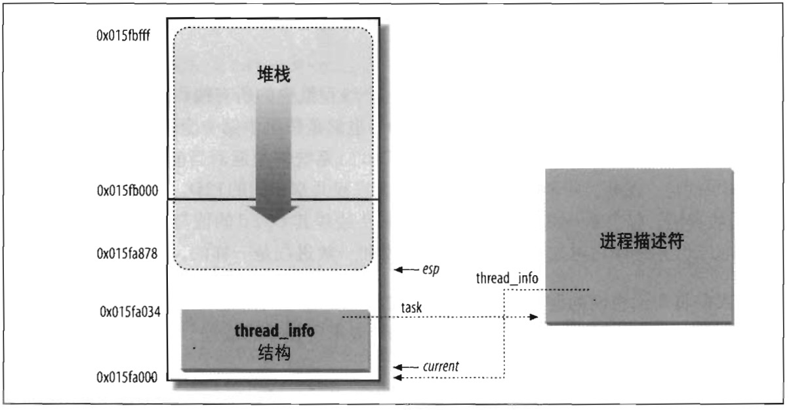

# 进程描述符处理

进程是动态实体，其生命周期范围从几毫秒到几个月。因此，内核必须能够同时处理很多进程，并把进程描述符存放在动态内存中，而不是放在永久分配给内核的内存区。对每个进程来说，Linux 都把两个不同的数据结构紧凑地存放在一个单独为进程分配的存储区域内：一个是内核态的进程堆栈，另一个是紧挨进程描述符的小数据结构 thread_info，叫做线程描述符，这块存储区域的大小通常为 8192 字节（两个页框）。考虑到效率的因素，内核让这 8K 空间占据连续的两个页框并让第一个页框的起始地址是 $$2^{13}$$ 的倍数。当几乎没有可用的动态内存空间时，就会很难找到这样的两个连续页框，因为空闲空间可能存在大量碎片（见第八章 “伙伴系统算法” 一节）。因此，在 80x86 体系结构中，在编译时可以进行设置，以使内核栈和线程描述符跨越一个单独的页框（4096 个字节）。

在第二章 “Linux 中的分段” 一节中我们已经知道，内核态的进程访问处于内核数据段的栈，这个栈不同于用户态的进程所用的栈。因为内核控制路径使用很少的栈，因此只需要几千个字节的内核态堆栈。所以，对栈和 thread_info 结构来说，8KB 足够了。不过，当使用一个页框存放内核态堆栈和 thread_info 结构时，内核要采用一些额外的栈以防止中断和异常的尝试嵌套而引起的溢出（见第四章）。

图 3-2 显示了 2 页（8KB）内存区中存放两种数据结构的方式。线程描述符驻留于这个内存区的开始，而栈从末端向下增长。该图还显示了分别通过 task 和 thread_info 字段使用 thread_info 结构与 task_struct 结构互相关联。



esp 寄存器是 CPU 栈指针，用来存放栈项单元的地址。在 80x86 系统中，栈起始于末端，并朝这个内存区开始的方向增长。从用户态刚切换到内核态以后，进程的内核栈总是空的，因此，esp 寄存器指向这个栈的顶端。

一旦数据写入堆栈，esp 的值就递减。因为 thread_info 结构是 52 个字节长，因此内核栈能扩展到 8140 字节。

C 语言使用下列的联合结构方便地表示一个进程的线程描述符和内核栈：
```
union thread_union {
    struct thread_info thread_info;
    unsigned long stack[2048]; /* 对 4K 的栈数组下标是 1024 */
};
```

如图 3-2 所示，thread_info 结构从 `0x015fa000` 地址处开始存放，而栈从 `0x015fc000` 地址处开始存放。esp 寄存器的值指向地址为 `0x015fa878` 的当前栈顶。

内核使用 `alloc_thread_info` 和 `free_thread_info` 宏分配和释放存储 thread_info 结构和内核栈的内存区。
