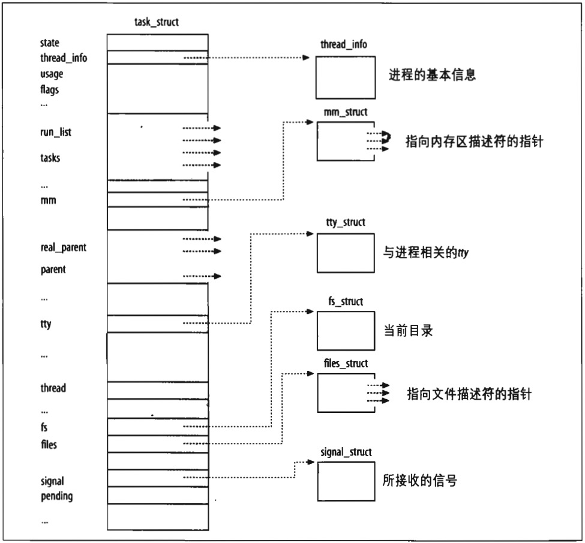

# 进程描述符

为了管理进程，内核必须对每个进程所做的事情进行清楚的描述。例如，内核必须知道进程的优先级，它是正在 CPU 上运行还是因某些事件而被阻塞，给它分配了什么样的地址空间，允许它访问哪个文件等等。这正是进程描述符（*process description*）的作用 --- **进程描述符都是 task_struct 类型结构，它的字段包含了与一个进程相关的所有信息**。

> 内核还定义了 task_t 数据类型来等同于 struct task_struct。

因为进程描述符中存放了那么多信息，所以它是相当复杂的。它不仅包含了很我进程属性的字段，而且一些字段 还包括了指向其他数据结构的指针，你这些类推。图 3-1 示意性地描述了 Linux 的进程描述符。

图右边的六个数据结构涉及进程所拥有的特殊资源，这些资源将在以后的章节中涉及到。本章集中讨论两种字段：进程的状态和进程的父/子间关系。
