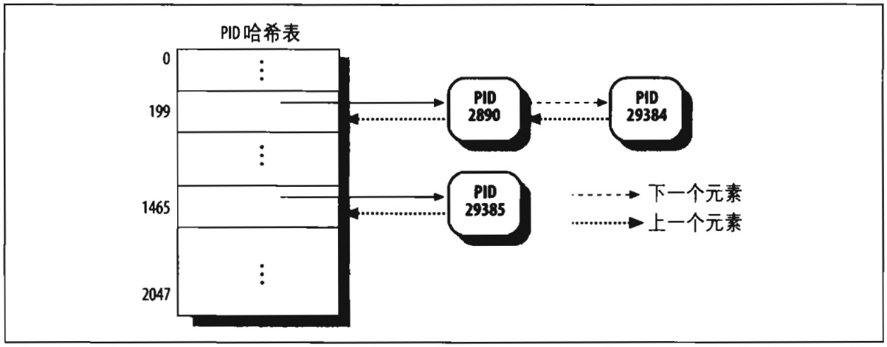
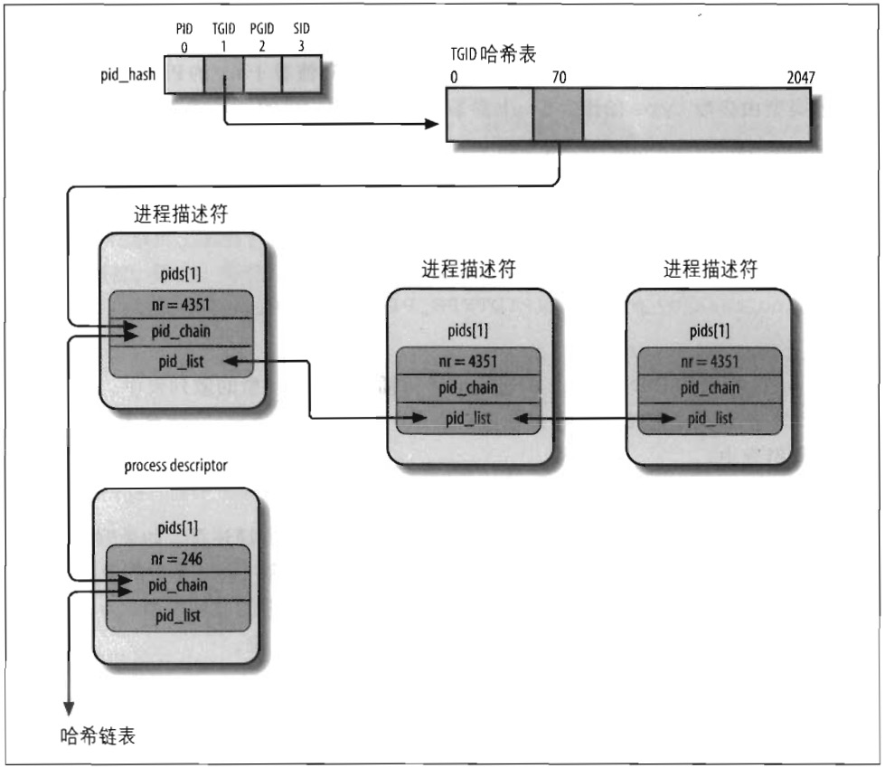

# 进程间的关系

程序创建的进程具有父/子关系。如果一个进程创建多个子进程时，则子进程之间具有兄弟关系。在进程描述符中引入几个字段 来表示这些关系，表示给定进程 P 的这些字段列在表 3-3 中。**进程 0 和 进程 1 是由内核创建的**；稍后我们将看到，进程 1（*init*）是所有进程的祖先。

**表 3-3：进程描述符中表示进程亲属关系的字段的描述**
字段名 | 说明
--- | ---
real_parent | 指向创建了 P 的进程的描述符，如果 P 的父进程不再存在，就指向进程 1（*init*）的描述符（因此，如果用户运行一个后台进程而且退出了 shell，后台进程就会成为 *init* 的子进程）
parent | 指向 P 的当前父进程（这种进程的子进程终止时，必须向父进程发信号）。它的值通常与 real_parent 一致，但偶尔也可以不同，例如，当另一个进程发出监控 P 的 `ptrace()` 系统调用请求时（参见第二十章中 “执行跟踪” 一节）
children | 链表的头部，链表中的所有元素都是 P 创建的子进程
sibling | 指向兄弟进程链表中的下一个元素或前一个元素的指针，这些兄弟进程的父进程都是 P

图 3-4 显示了一组进程间的亲属关系。进程 P0 接连创建了 P1、P2、P3。进程 P3 又创建了 P4。

特别要说明的是，进程之间还存在其他关系：
- 一个进程可能是一个进程组或登录会话的领头进程（参见第一章 “进程管理” 一节）
- 一个进程可能是一个线程组的领头进程（参见本章前面 “标识一个进程” 一节）
- 一个进程可能跟踪其他进程的执行（参见第二十章 “执行跟踪” 一节）


表 3-4 列出了进程描述符中的一些字段，这些字段 建立起进程 P 和其他进程之间的关系。

**表 3-4：建立非亲属关系的进程描述符字段**
字段名 | 说明
group_leader | P 所在进程组的领头进程的描述符指针
signal->pgrp | P 所在进程组的领头进程的 PID
tgid | P 所在线程组的领头进程的 PID
signal->session | P 的登录会话领头进程的 PID
ptrace_children | 链表的头，该链表包含所有被 debugger 程序跟踪的 P 的子进程
ptrace_list | 指向所跟踪进程其实际父进程链表的前一个和下一个元素（用于 P 被跟踪的时候）

## pidhash 表及链表

在几种情况下，内核必须能从进程的 PID 导出对应的进程描述符指针。例如，为 `kill()` 系统调用提供服务时就会发生这种情况：当进程 P1 希望向另一个进程 P2 发送一个信号时，P1 调用 `kill()` 系统调用，其参数为 P2 的 PID，内核从这个 PID 导出其对应的进程描述符，然后从 P2 的进程描述符中取出记录挂起信号的数据结构指针。

顺序扫描进程链表并检查进程描述符的 pid 字段是可行但相当低效的。为了加速查找，引入了 4 个散列表。需要 4 个散列表是因为进程描述符包含了表示不同类型 PID 的字段（见表 3-5），而且每种类型的 PID 需要它自己的散列表。

**表 3-5：4 个散列表和进程描述符中的相关字段**
Hash 表的类型 | 字段名 | 说明
--- | --- | ---
PIDTYPE_PID | pid | 进程的 PID
PIDTYPE_TGID | tgid | 线程组领头进程的 PID
PIDTYPE_PGID | pgrp | 进程组领头进程的 PID
PIDTYPE_SID | session | 会话领头进程的 PID

内核初始化期间动态地为 4 个散列表分配空间，并把它们的地址存放 pid_hash 数组。一个散列表的长度依赖于可用 RAM 的容量，例如：一个系统拥有 512 MB 的 RAM，那么每个散列表就存在 4 个页框中，可以拥有 2048 个表项。

用 `pid_hashfn` 宏把 PID 转化为表索引，`pid_hashfn` 宏展开为：
```
#define pid_hashfn(x) hash_long((unsigned long) x, pidhash_shift)
```

变量 `pidhash_shift` 用来存放表索引的长度（以位为单位的长度，在我们的例子里是 11 位）。很多散列函数都是使用 `hash_long()`，在 32 位体系结构中它基本等价于：
```
unsigned long hash_long(unsigned long val, unsigned int bits)
{
    unsigned long hash = val * 0x9e370001UL;
    return hash >> (32 - bits);
}
```

因为在我们的例子中 `pidhash_shift == 11`，所以 `pid_hashfn` 的取值范围是 0 到 $$2^{11} - 1 = 2047$$。

正如计算机科学的基础课程所阐述的那样，散列（hash）函数并不总能确保 PID 与表的索引一一对应。两个不同的 PID 散列（hash）到相同的表索引称为冲突（*colliding*）。

```
魔数常量
......
```

Linux 利用链表来处理冲突的 PID：每个表项是由冲突的进程描述符组成的双向链表。

图 3-5 显示了具有两个链表的 PID 散列表。进程号（PID）为 2890 和 29384 的两个进程散列到这个表的第 200 个元素，而进程号（PID）为 29385 的进程散列到这个表的第 1466 个元素。



具有链表的散列法比从 PID 到表索引的线性转换更优越，这是因为在任何给你写的实例中，系统中的进程数总是远远小于 32768（所允许的进程 PID 的最大数）。如果在任何给定的实例中大部分表项都不使用的话，那么把表定义为 32768 项会是一种存储浪费。

由于需要跟踪进程间的关系，PID 散列表中使用的数据结构非常复杂。看一个例子：假设内核必须回收一个指定线程组中的所有进程，这意味着这些进程的 tgid 的值是相同的，都等于一个给定值。如果根据线程组号查找散列表，只能返回一个进程描述符，就是线程组领头进程的描述符。为了能快速返回组中其他所有进程，内核就必须为每个线程组保留一个进程链表。在查找给定登录会话或进程组的进程时也会有同样的情形。

PID 散列表的数据结构解决了所有这些难题，因为它们可以为包含在一个散列表中的任何 PID 号定义进程链表。最主要的数据结构是四个 pid 结构的数组，它在进程描述符的 pid 字段中，表 3-6 显示了 pid 结构的字段。

**表 3-6：pid 结构的字段**
类型 | 名称 | 描述
--- | --- | ---
int | nr | pid 的数值
struct hlist_node | pid_chain | 链接散列链表的下一个和前一个元素
struct list_head | pid_list | 每个 pid 的进程链表头



图 3-6 给出了 PIDTYPE_TGID 类型散列表的例子。pid_hash 数组的第二个元素存放散列表的地址，也就是用 hlist_head 结构的数组表示链表的头。在散列表第 71 项为起点形成的链表中，有两个 PID 号为 246 和 4351 的进程描述符（双箭头线表示一结向前和向后的指针）。PID 的值存放在 pid 结构的 nr 字段中，而 pid 结构在进程描述符中。

> 顺便提一下，由于线程组的号和它的首创者的 PID 相同，因此这些 PID 值也存在进程描述符的 pid 字段中。

我们考虑线程组 4351 的 PID 链表：散列表中的进程描述符的 pid_list 字段中存放链表的头，同时每个 PID 链表中指向前一个元素和后一个元素的指针也存放在每个链表元素的 pid_list 字段中。

下面是处理 PID 散列表的函数和宏：

* **do_each_task_pid(nr,type,task)**  
&emsp;

* **while_each_task_pid(nr,type,task)**  
标记 do-while 循环的开始和结束，循环作用在 PID 值等于 nr 的 PID 链表上，链表的类型由参数 type 给出，task 参数指向当前被扫描的元素的进程描述符。  
&emsp;

* **find_task_by_pid_type(type,nr)**  
在 type 类型的散列表中查找 PID 等于 nr 的进程。该函数返回所匹配的进程描述符指针，若没有匹配的进程，函数返回 NULL。  
&emsp;

* **find_task_by_pid(nr)**  
与 find_task_by_pid_type(PIDTYPE_PID,nr) 相同。  
&emsp;

* **attach_pid(task,type,nr)**  
把 task 指向的 PID 等于 nr 的进程描述符插入 type 类型的散列表中。如果一个 PID 等于 nr 的进程描述符已经在散列表中，这个函数就只把 task 插入已有的 PID 进程链表中。  
&emsp;

* **detach_pid(task,type)**  
从 type 类型的 PID 进程链表中删除 task 所指向的进程描述符。如果删除后 PID 进程链表没有变为空，则函数终止，否则，该函数还要从 type 类型的散列表中删除进程描述符。最后，如果 PID 的值没有出现在任何其他的散列表中，为了这个值能够被反复使用，该函数还必须清除 PID 位图中的相应位。  
&emsp;

* **next_thread(task)**  
返回 PIDTYPE_TGID 类型的散列表链表中 task 批示的下一个轻量级进程的进程描述符。由于散列链表的循环的，若应用于传统的进程，那么该宏返回进程本身的描述符地址。  
&emsp;

