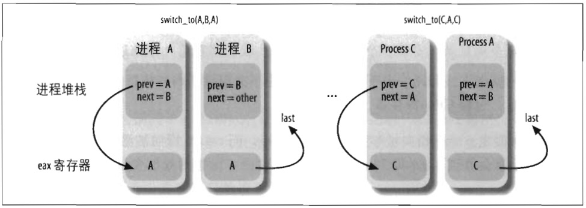

# 执行进程切换

进程切换可能只发生在精心定义的点：`schedule()` 函数（在第七章会用很长的篇幅来讨论）。这里，我们仅关注内核如何执行一个进程切换。

从本质上说，每个进程切换由两步组成：  
1. 切换页全局目录以安装一个新的地址空间（我们将在第九章描述这一步）；
2. 切换内核态堆栈和硬件上下文，因为硬件上下文件提供了内核执行新进程所需要的所有信息，包含 CPU 寄存器。

我们又一次假定 prev 指向被替换进程的描述符，而 next 指向被激活进程的描述符。我们在第七章会看到，prev 和 next 是 `schedule()` 函数的局部变量。

## switch_to 宏

进程切换的第二步由 `switch_to` 宏执行。它是内核中与硬件关系最密切的例程之一，要理解它到底做了些什么我们必须下些功夫。

首先，该宏有三个参数，它们是 prev、next 和 last。你可能很容易猜到 prev 和 next 的作用：它们仅是局部变量 prev 和 next 的占位符，即它们是输入参数，分别表示被替换进程和新进程描述符的地址在内存中位置。

而第三个参数 last 呢？在任何进程切换中，涉及到三个进程而不是两个。假设内核永定暂停进程 A 而激活进程 B。在 `schedule()` 函数中，prev 指向 A 的描述符而 next 指向 B 的描述符。`switch_to` 宏一旦使 A 暂停，A 的执行流就冻结。

随后，当内核想再次激活 A，就必须暂停另一个进程 C（这通常不同于 B），于是就要用 prev 指向 C 而 next 指向 A 来执行另一个 `switch_to` 宏。当 A 恢复它的执行流时，就会找到它原来的内核栈，于是 prev 局部变量还是指向 A 的描述符而 next 指向 B 的描述符。此时，代表进程 A 执行的内核就失去对 C 的任何引用。但是，事实表明这个引用对于完成进程切换是很有用的（更多细节参见第七章）。

`switch_to` 宏的最后一个参数是输出参数，它表示宏把进程 C 的描述符地址写在内存的什么位置了（当然，这是在 A 恢复执行之后完成的）。在进程切换之前，宏把第一个输入参数 prev（即在 A 的内核堆栈中分配的 prev 局部变量）表示的变量的内容存入 CPU 的 eax 寄存器。在完成进程切换，A 已经恢复执行时，宏把 CPU 的 eax 寄存器的内容写入由第三个输出参数 --- last 所指示的 A 在内存中的位置。因为 CPU 寄存器不会在切换点发生变化，所以 C 的描述符地址也存在内存的这个位置。在 `schedule()` 执行过程中，参数 last 指向 A 的局部变量 prev，所以 prev 被 C 的地址覆盖。

图 3-7 显示了进程 A,B,C 内核堆栈的内容以及 eax 寄存器的内容。必须注意的是：图中显示的是在被 eax 寄存器的内容覆盖以前的 prev 局部变量的值。



由于 `switch_to` 宏采用扩展的内联汇编语言编码，所以可读性比较差：实际上这段代码通过特殊位置记数法使用寄存器，而实际使用的能用寄存器由编译器自由选择。我们将采用标准汇编语言而不是麻烦的内联汇编语言来描述 `switch_to` 宏在 80x86 微处理器上所完成的典型工作。

1. eax 和 edx 寄存中分别保存 prev 和 next 的值：  
```
movl prev,%eax
movl next,%edx
```
&emsp;

2. 把 eflags 和 ebp 寄存器的内容保存在 prev 内核栈中。必须保存它们的原因是编译器认为在 `switch_to` 结束之前它们的值应当保持不变。  
```
pushfl
pushl %ebp
```
&emsp;

3. 把 esp 的内容保存到 `prev->thread.esp` 中以使该字段指向 prev 内核栈的栈顶：  
```
movl %esp,484(%eax)
```
    484(%eax) 操作数表示内存单元的地址为 eax 内容加上 484。  
&emsp;

4. 把 `next->thread.esp` 装入 esp。此时，内核开始在 next 的内核栈上操作，因此这条指令实际上完成了从 prev 到 next 的切换。由于进程描述符的地址和内核栈的地址紧挨着（就像我们在本章前面 “标识一个进程” 一节所解释的），所以改变内核栈意味着改变当前进程。  
```
movl 484(%edx), %esp
```
&emsp;

5. 把标记为 1 的地址（本节后面所示）存入 `prev->thread.eip`。当被替换的进程重新恢复执行时，进程执行被标记为 1 的那条指令：  
```
movl %1f, 480(%eax)
```
&emsp;

6. 宏把 `next->thread.eip` 的值（绝大多数情况下是一个被标记为 1 的地址）压入 next 的内核栈：  
```
pushl 480(%edx)
```
&emsp;

7. 跳到 `__switch_to()` C 函数：  
```
jmp__switch_to
```
&emsp;

8. 这里被进程 B 替换的进程 A 两次获得 CPU：它执行一些保存 eflags 和 ebp 寄存器内容的指令，这两条指令的第一条指令被标记为 1。  
```
1:
    popl %ebp
    popfl
```
注意这些 pop 指令是怎样引用 prev 进程的内核栈的。当进程调度程序选择了 prev 作为新进程在 CPU 上运行时，将执行这些指令。于是，以 prev 作为第二个参数调用 `switch_to`。因此，esp 寄存器指向 prev 的内核栈。  
&emsp;

9. 拷贝 eax 寄存器（上面步骤 1 中被装载）的内容到 `switch_to` 宏的第三个参数 last 标识的内存区域中：  
```
movl %eax, last
```
正如先前讨论的，eax 寄存器指向刚被替换的进程的描述符。  

    > 正如本节前面所叙述的，当前执行的 `schedule()` 函数重新使用了 prev 局部变量，于是汇编语言指令就是：`movl %eax,prev`  
&emsp;

## __switch_to() 函数

`__switch_to()` 函数执行大多数开始于 `switch_to` 宏的进程切换。这个函数作用于 prev_p 和 next_p 参数，这两个参数表示前一个进程和新进程。这个函数的调用不同一般函数的调用，因为 `__switch_to()` 从 eax 和 edx 取参数 prev_p 和 next_p（我们在前面已看到这些参数就是保存在那里），而不像大多数函数一样从栈中取参数。为了强迫函数从寄存器取它的参数，内核利用 `\_\_attribute\_\_` 和 `regparm` 关键字，这两个关键字是 C 语言非标准的扩展名，由 gcc 编译程序实现。在 `include/asm-i386/system.h` 头文件中， `__switch_to()` 函数的声明如下：  

```
__switch_to(struct task_struct *prev_p, struct task_struct *next_p)
__attribute__(regparm(3));
```

函数执行的步骤如下：  

1. 执行由 `unlazy_fpu()` 宏产生的代码（参见本章稍后 “保存和加载 FPU、MMX 及 XMM 寄存器” 一节），以有选择地保存 prev_p 进程的 FPU、MMX 及 XMM 寄存器的内容。  
```
__unlazy_fpu(prev_p);
```
&emsp;

2. 执行 `smp_processor_id()` 宏获得本地（*local*）CPU 的下标，即执行代码的 CPU。该宏从当前进程的 thread_info 结构的 cpu 字段获得下标并将它保存到 cpu 局部变量。  
&emsp;

3. 把 `nexp_p->thread.esp0` 装入对应于本地 CPU 的 TSS 的 esp0 字段；我们将在第十章的 “通过 sysenter 指令发生系统调用” 一节看到，以后任何由 systenter 汇编指令产生的从用户态到内核态的特权级转换将把这个地址拷贝到 esp 寄存器中：  
```
init_tss[cpu].esp0 = next->thread.esp0;
```
&emsp;

4. 把 next_p 进程使用的线程局部存储（TLS）段装入本地 CPU 的全局描述符表；三个段选择符保存在进程描述符内的 tls_array 数组中（参见第二章的 “Linux 中的分段” 一节）。  
```
cpu_gdt_table[cpu][6] = next_p->thread.tls_arry[0];
cpu_gdt_table[cpu][7] = next_p->thread.tls_arry[1];
cpu_gdt_table[cpu][8] = next_p->thread.tls_arry[2];
```
&emsp;

5. 把 fs 和 gs 段寄存器的内容分别存放在 `prev-P->thread.fs` 和 `prev-P->thread.gs` 中，对应的汇编语言指令是：  
```
movl %fs, 40(%esi)
movl %gs, 44(%esi)
```
    esi 寄存器指向 `prev_p->thread` 结构。
&emsp;

6. 如果 fs 或 gs 段寄存器已经被 prev_p 和 next_p 进程中的任意一个使用（也就是说如果它们有一个非 0 的值），则将 next_p 进程的 thread_struct 描述符中保存的值装入这些寄存器中。这一步在逻辑上补充了前一步执行的操作。主要的汇编语言指令如下：  
```
movl 40(%ebx),%fs
movl 44(%ebx),%gs
```
    ebx 寄存器指向 `next_p->thread` 结构。代码实际上更复杂，因为当它检测到一个无效的段寄存器值时，CPU 可能产生一个异常。代码采用一种 “修正（fix-up）” 途径来考虑这种可能性（参见第十章 “动态地址检查：修正代码” 一节）。  
&emsp;

7. 用 `next_p->thread.debugreg` 数组的内容装载 dr0......dr7 中的 6 个调试寄存器。只有在 next_p 被挂起时正在使用调试寄存器（也就是说，`next_p->thread.debugreg[7]` 字段不为 0），这种操作才能进行。这些寄存器不需要被保存，因为只有当一个调试器想要监控 prev 时 `prev_thread.debugreg` 才会被修改。  
```
if (next_p-thread.debugreg[7]) {
    loaddebug(&next_p->thread, 0);
    loaddebug(&next_p->thread, 1);
    loaddebug(&next_p->thread, 2);
    loaddebug(&next_p->thread, 3);
    /* 没有 4 和 5 */
    loaddebug(&next_p->thread, 6);
    loaddebug(&next_p->thread, 7);
}
```
    > 80x86 调试寄存器允许进程被硬件监控。最多可定义 4 个断点区域。一个被监控的进程只要产生一个线性地址位于个断点区域中之一，就会产一个异常。  
&emsp;

8. 如果必要，更新 TSS 中的 I/O 位图。当 next_p 或 prev_p 有其自己的定制 I/O 权限位图时必须这么做：  
```
if (prev_p->thread.io_bitmap_ptr || next_p->thread.io_bitmap_ptr)
    handle_io_bitmap(&next_p->thread, &init_tss[cpu]);
```
    因为进程很少修改 I/O 权限位图，所以该位图在 “懒” 模式中被处理：当且仅当一个进程在当前时间片内实际访问 I/O 端口时，真实位图才被拷贝到本地 CPU 和 TSS 中。进程的定制 I/O 权限位图被保存在 thread_info 结构的 io_bitmap_ptr 字段指向的缓冲区中。`headle_io_bitmap()` 函数为next_p 进程设置本地 CPU 使用的 TSS 的 io_bitmap 字段如下：  
    - 如果 next_p 进程不拥有自己的 I/O 权限位图，则 TSS 的 io_bitmap 字段被设置为 `0x8000`。
    - 如果 next_p 进程拥有自己的 I/O 权限位图，则 TSS 的 io_bitmap 字段被设置为 `0x9000`。
    &emsp;
    TSS 的 io_bitmap 字段应当包含一个在 TSS 中的偏移量，其中存放实际位图。无论何时用户态进程试图访问一个 I/O 端口，`0x8000` 和 `0x9000` 指向 TSS 界限之外并将因此引起 “General protection” 异常（参见第四章的 “异常” 一节）。`do_general_protection()` 异常处理程序将检查保存在 io_bitmap 字段的值：  
    - 如果是 `0x8000`，函数发送一个 SIGSEGV 信号给用户态进程；
    - 如果是 `0x9000`，函数把进程位图（由 thread_info 结构中的 io_bitmap_ptr 字段指示）拷贝到本地 CPU 的 TSS 中，把 io_bitmap字段设置为实际位置的偏移（104），并强制再一次执行有缺陷的汇编语言指令。  
&emsp;

9. 终止 `__switch_to()` C 函数通过使用下列声明结束：  
```
return prev_p;
```
    由编译器产生的相应汇编语言指令是：
    ```
    movl %edi. %eax
    ret
    ```
    prev_p 参数（现在在 edi 中）被拷贝到 eax，因为缺省情况下任何 C 函数的返回值被传递给 eax 寄存器。注意 eax 的值因此在调用 `__switch_to()` 的过程中被保护起来；这非常重要，因为调用 `switch_to` 宏时会假定 eax 总是用来存放将被替换的进程描述符的地址。  
    汇编语言指令 ret 把栈顶保存的返回地址装入 eip 程序计数器。不过，通过简单地跳转到 `__switch_to()` 函数来调用该函数。因此，ret 汇编指令在栈中找到标号为 1 的指令的地址，其中标号为 1 的地址是由 `switch_to()` 宏推入栈中的。如果因为 next_p 第一次执行而以前从示被挂起，`__switch_to()` 就找到 `ret_from_fork()` 函数的起始地址（参见本章后面 “clone(), fork() 和 vfork() 系统调用” 一节）。

