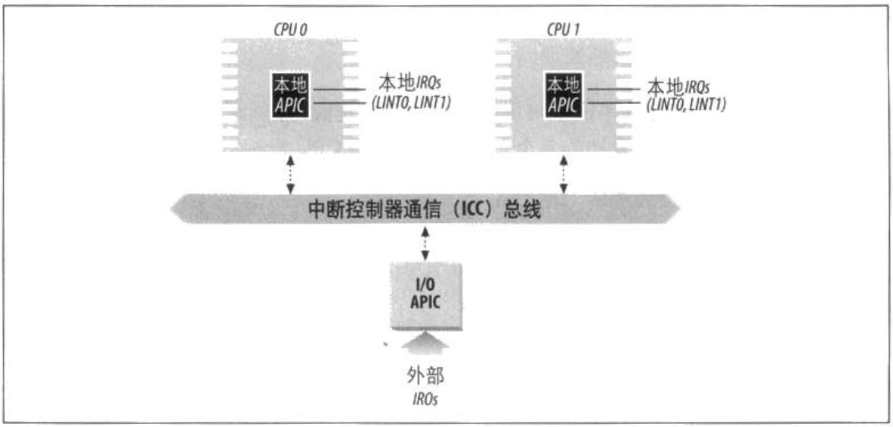

# 高级可编程中断控制器

以前的描述仅涉及为单处理器系统设计的 PIC。如果系统只有一个单独的 CPU，那么主 PIC 的输出线以直截了当的方式连接到 CPU 的 INTR 引脚。然而，如果系统中包含两个或多个 CPU，那么这种方式不再有效，因而需要更复杂的 PIC。

为了充分发挥 SMP 体系结构的并行性，能够把中断传递给系统中的每个 CPU 至关重要。基于此理由，Intel 从 Pentium III 开始引入了一种名为 I/O 高级可编程控制器（*I/O Advanced
Programmable Interrupt Controller, I/O APIC*）的新组件，用以代替老式的 8259A 可编程中断控制器。新近的主板为了支持以前的操作系统都包括两种芯片。此外，80x86 微处理器当前所有的 CPU 都含有一个本地 APIC。每个本地 APIC 都有 32 位的寄存器、一个内部时钟、一个本地定时设备及为本地 APIC 中断保留的两条额外的 IRQ 线 LINTO 和 LINT1。所有本地 APIC 都连接到一个外部 I/O APIC，形成一个多 APIC的系统。

图 4-1 以示意图的方式显示了一个多 APIC 系统的结构。一条 APIC 总线把 “前端” I/O APIC 连接到本地 APIC。来自设备的 IRQ 线连接到 I/O APIC，因此，相对于本地 APIC，I/O APIC 起路由器的作用。在 Pentium III 和早期处理器的母板上，APIC 总线是一个串行三线总线：从 Pentium 4 开始，APIC 总线通过系统总线来实现。不过，因为 APIC 总线及其信息对软件是不可见的，因此，我们不做进一步的详细讨论。

I/O APIC的组成为：一组 24 条 IRQ 线、一张 24 项的中断重定向表（*Interrupt Redirecrion Table*）、可编程寄存器，以及通过 APIC 总线发送和接收 APIC 信息的一个信息单元。与 8259A 的 IRQ 引脚不同，中断优先级并不与引脚号相关联：中断重定向表中的每一项都可以被单独编程以指明中断向量和优先级，自标处理器及选择处理器的方式。重定向表中的信息用于把每个外部IRQ信号转换为一条消息，然后，通过APIC总线把消息发送给一个或多个本地 APIC 单元。

来自外部硬件设备的中断请求以两种方式在可用 CPU 之间分发：
* *静态分发*  
IRQ 信号传递给重定向表相应项中所列出的本地 APIC。中断立即传递给一个特定的 CPU，或一组 CPU，或所有 CPU（广播方式）。  
&emsp;

* *动态分发*  
如果处理器正在执行最低优先级的进程，IRQ 信号就传递给这种处理器的本地 APIC每个本地 APIC 都有一个可编程任务优先级寄存器（*task prioriry register，TPR*），TPR 用来计算当前运行进程的优先级。Intel 希望在操作系统内核中通过每次进程切换对这个寄存器进行修改。  

    如果两个或多个 CPU 共享最低优先级，就利用仲裁（*arbitrarion*）技术在这些 CPU 之间分配负荷。在本地 APIC 的仲裁优先级寄存器中，给每个 CPU 都分配一个 0（最低）~15（最高）范围内的值。  

    每当中断传递给一个 CPU 时，其相应的仲裁优先级就自动置为 0，而其他每个 CPU的仲裁优先级都增加 1。当仲裁优先级寄存器大于 15 时，就把它置为获胜 CPU 的前一个仲裁优先级加 1。因此，中断以轮转方式在 CPU 之间分发，且具有相同的任务优先级。

> Pentium 4 本地 APIC 没有仲裁优先级寄存器：仲裁机制隐藏在总线仲裁电路中。Intel 手册中声明，如果操作系统内核不能有规律地更新任务优先级寄存器，那么性能可能就达不到最优，因为中断有可能总是由同一个 CPU 处理。

除了在处理器之间分发中断外，多 APIC 系统还允许 CPU 产生处理器间中断（*interprocessor interrupt*）。当一个 CPU 希望把中断发给另一个 CPU 时，它就在自己本地 APIC 的中断指令寄存器（Interrupt Command Register，ICR）中存放这个中断向量和目标本地 APIC 的标识符。然后，通过 APIC 总线向目标本地 APIC 发送一条消息，从而向自己的 CPU 发出一个相应的中断。

处理器间中断（简称 IPI ）是 SMP 体系结构至关重要的组成部分，并由 Linux 有效地用来在 CPU 之间交换信息（参见本章后面）。

自前大部分单处理器系统都包含一个 I/O APIC 芯片，可以用以下两种方式对这种芯片进行配置：
- 作为一种标准 8259A 方式的外部 PIC 连接到 CPU。本地 APIC 被禁止，两条 LINTO 和 LINT1 本地 IRQ 线分别配置为 INTR 和 NMI 引脚。
- 作为一种标准外部 I/O APIC。本地 APIC 被激活，且所有的外部中断都通过 I/O APIC接收。

