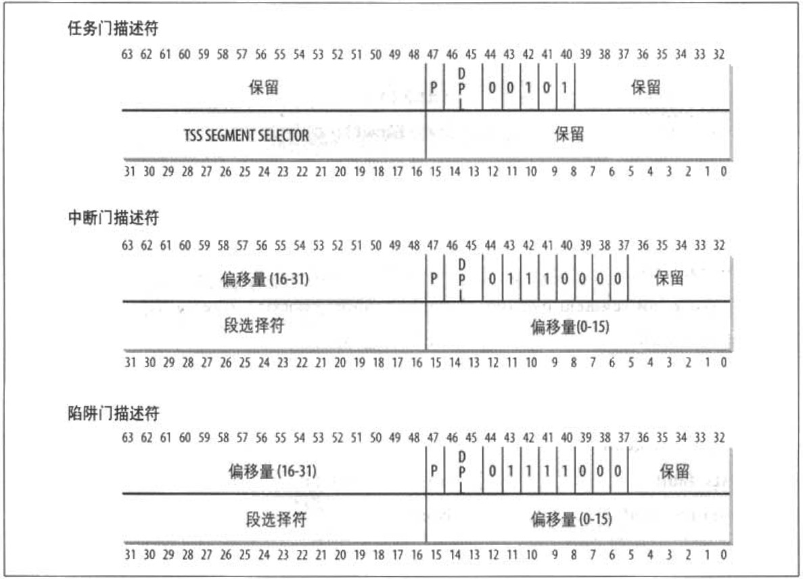

# 中断描述符表

中断描述符表（*Interrupt Descripror Table，IDT*）是一个系统表，它与每一个中断或异常向量相联系，**每一个向量在表中有相应的中断或异常处理程序的入口地址**。内核在允许中断发生前，必须适当地初始化 IDT。

在第二章中，我们介绍了 GDT 和 LDT，IDT 的格式与这两种表的格式非常相似，表中的每一项对应一个中断或异常向量，**每个向量由 8 个字节组成**。因此，最多需要 256×
8=2048 字节来存放 IDT。

idtr CPU 寄存器使 IDT 可以位于内存的任何地方，它指定 IDT 的线性基地址及其限制（最大长度）。在允许中断之前，必须用 lidt 汇编指令初始化 idtr。

IDT 包含三种类型的描述符，图 4-2显示了每种描述符中的 64 位的含义。无其值得注意的是，在 40-43 位的 Type 字段的值表示描述符的类型。

这些描述符是：
* *任务门（task gate）*  
当中断信号发生时，必须取代当前进程的那个进程的 TSS 选择符存放在任务门中。  
&emsp;

* *中断门（interrupt gate）*  
包含段选择符和中断或异常处理程序的段内偏移量。当控制权转移到一个适当的段时，处理器清 IF 标志，从而关闭将来会发生的可屏蔽中断。  
&emsp;

* *陷阱门（Trap gate）*  
与中断门相似，只是控制权传递到一个适当的段时处理器不修改 IF 标志。  
&emsp;

正如我们将在 “中断门、陷阱门及系统门” 一节中所看到的那样，Linux 利用中断门处理中断，利用陷阱门处理异常。

> “Double fault” 异常是唯一由任务门处理的异常、它表示一种内核错误（参见本章稍后 “异常处理” 一节）。
