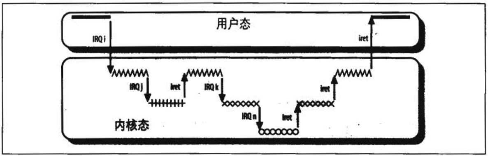

# 中断和异常处理程序的嵌套执行
每个中断或异常都会引起一个内核控制路径，或者说代表当前进程在内核态执行单独的指令序列。例如：当 I/O 设备发出一个中断时，相应的内核控制路径的第一部分指令就是那些把寄存器的内容保存在内核堆栈的指令，而最后一部分指令就是恢复寄存器内容并让 CPU 返回到用户态的那些指令。

内核控制路径可以任意嵌套；一个中断处理程序可以被另一个中断处理程序 “中断”，因此引起内核控制路径的嵌套执行，如图 4-3 所示。其结果是，对中断进行处理的内核控制路径，其最后一部分指令并不总能使当前进程返回到用户态：如果嵌套深度大于 1，这些指令将执行上次被打断的内核控制路径，此时的CPU依然运行在内核态。

允许内核控制路径嵌套执行必须付出代价，那就是中断处理程序必须永不阻塞，换句话说，中断处理程序运行期间不能发生进程切换。事实上，联套的内核控制路径恢复执行时需要的所有数据都存放在内核态堆栈中，这个栈基无疑义的属于当前进程。

假定内核没有 bug，那么大多数异常就只在 CPU 处于用户态时发生。事实上，异常要么是由编程错误引起，要么是由调试程序触发。然而，“Page Fault（缺页）” 异常发生在内核态。这发生在当进程试图对属于其地址空间的页进行寻址，而该页现在不在 RAM 中时。当处理这样的一个异常时，内核可以挂起当前进程，并用另一个进程代替它，直到请求的页可以使用为止。只要被挂起的进程又获得处理器，处理缺页异常的内核控制路径就恢复执行。

因为 “Page Fault” 异常处理程序从不进一步引起异常，所以与异常相关的至多两个内核控制路径（第一个由系统调用引起，第二个由缺页引起）会堆叠在一起，一个在另一个之上。

与异常形成对照的是，尽管处理中断的内核控制路径代表当前进程运行，但由 I/O 设备产生的中断并不引用当前进程的专有数据结构。事实上，当一个给定的中断发生时，要预测哪个进程将会运行是不可能的。

**一个中断处理程序既可以拾点其他的中断处理程序，也可以抢占异常处理程序。相反异常处理程序从不抢占中断处理程序**。在内核态能触发的唯一异常就是刚刚描述的缺页异常。但是，中断处理程序从不执行可以导致缺页（因此意味着进程切换）的操作。

基于以下两个主要原因，Linux交错执行内核控制路径：  
- 为了提高可编程中断控制器和设备控制器的吞吐量。假定设备控制器在一条 IRQ 线上产生了一个信号，PIC 把这个信号转换成一个外部中断，然后 PIC 和设备控制器保持阻塞，一直到 PIC 从 CPU 处接收到一条应答信息。由于内核控制路径的交错执行，内核即使正在处理前一个中断，也能发送应答。
- 为了实现一种没有优先级的中断模型。因为每个中断处理程序都可以被另一个中处理程序延缓，因此，在硬件设备之间没必要建立预定义优先级。这就简化了内核代码，提高了内核的可移植性。

在多处理器系统上，几个内核控制路径可以并发执行。此外，与异常相关的内核控制路径可以开始在一个 CPU 上执行，并且由于进程切换而移往另一个 CPU 上执行。
